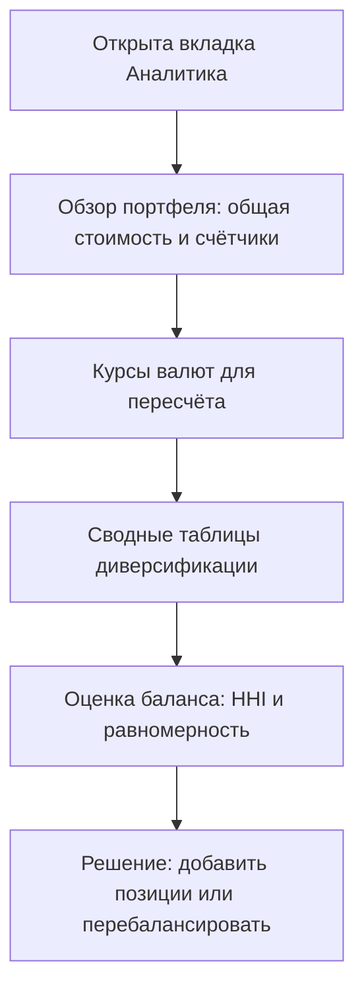
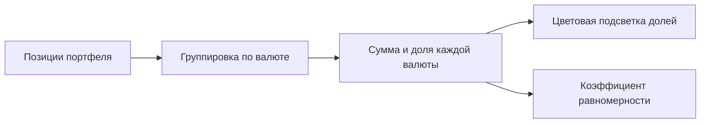
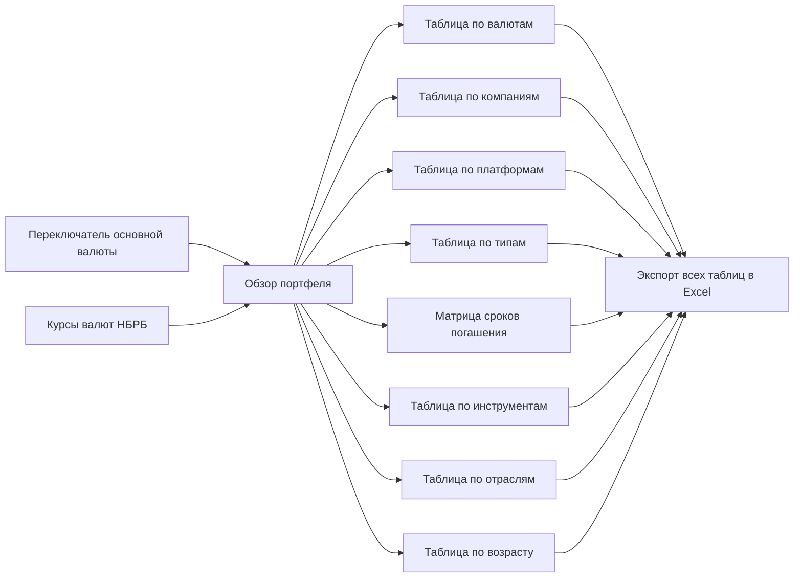

## Введение

Вкладка «Аналитика» помогает понять, как именно распределены ваши деньги внутри портфеля. В то время как вкладка «Позиции» показывает каждый инструмент по отдельности, здесь те же данные собраны в сводные таблицы: сколько средств приходится на каждую валюту, компанию, платформу, тип инструмента, отрасль и так далее.

Эта вкладка отвечает на вопросы:

- Насколько портфель сбалансирован — нет ли опасного перекоса в одну компанию или один токен?
- В каких валютах и на каких платформах сосредоточены деньги?
- Когда ожидаются погашения активов и насколько равномерно они распределены по срокам?
- Какие компании и отрасли занимают слишком большую долю?

Все суммы здесь показаны в основной валюте портфеля (BYN, EUR или USD), которую можно переключить вверху страницы. Курсы валют берутся с сайта Национального банка.



[](https://cdn-wiki.tokenbel.info/wiki/media/images/17/17d3abc413e2bd873372db75085a5a839fc755abf7ac8d1a8ab3281a01d2970a.png)

---

### Как рассчитываются показатели

Все таблицы на этой вкладке построены по общим правилам. Понимание этих правил поможет читать любую таблицу одинаково уверенно.

#### Стоимость одной позиции

Стоимость позиции считается по текущей цене одной единицы, а не по цене покупки:

```text
Стоимость позиции = Количество × Текущая цена (или номинал)
```

Если у инструмента нет рыночной цены, используется номинальная цена. Затем стоимость пересчитывается в основную валюту портфеля по актуальному курсу. Акции, у которых нет процентной ставки, в расчёт средней ставки не входят.

#### Общая стоимость портфеля

```text
Общая стоимость = Σ Стоимость каждой позиции (в основной валюте)
```

Именно эта сумма — 100%, от которой считаются все доли в таблицах.

#### Доля группы

```text
Доля = Сумма группы ÷ Общая стоимость × 100%
```

Например, если общая стоимость портфеля 10 000 BYN, а на одну компанию приходится 4 000 BYN, её доля — 40%.

#### Цветовая подсветка долей

Каждая ячейка «Доля» окрашивается в зависимости от того, насколько группа крупнее «идеальной» равной доли. Идеальная доля — это когда все деньги поделены поровну между всеми группами:

```text
Идеальная доля = 100% ÷ Количество групп
```

Цвет определяется так:

- **Зелёный** — доля не превышает идеальную. Группа занимает разумное место.
- **Оранжевый** — доля заметно выше идеальной, но не критично (до полутора раз от идеальной).
- **Красный** — доля слишком велика (более чем в полтора раза выше идеальной). Это потенциальный источник риска.
- **Красный (критический)** — используется, когда в таблице всего одна группа. Вся сумма сосредоточена в одном месте, и диверсификации нет.

#### Индекс концентрации (HHI)

Индекс Херфиндаля — это числовая оценка того, насколько портфель «сконцентрирован» в нескольких крупных группах. Он показан над таблицами по компаниям и по инструментам:

```text
HHI = Σ (Доля группы в процентах)²
```

Значение находится в диапазоне от 0 до 10 000. Чем выше число, тем сильнее концентрация:

- **Меньше 1000 — низкая концентрация (зелёный).** Идеальная диверсификация, портфель устойчив, как широкий рыночный индекс. Для этого нужно более 10 позиций с примерно равными долями.
- **От 1000 до 1800 — умеренная концентрация (оранжевый).** Рабочий портфель: есть явные лидеры, но риск распределён приемлемо.
- **Больше 1800 — высокая концентрация (красный).** Портфель сильно зависит от нескольких крупных вложений. Дефолт одного эмитента может нанести значительный ущерб.

Например, портфель из трёх компаний с долями 50%, 30% и 20% даёт HHI = 50² + 30² + 20² = 2500 + 900 + 400 = 3800 — высокая концентрация.

Подробнее о том, что такое [индекс Герфиндаля-Хиршмана (HHI)](https://tokenbel.info/faq/#hhi) и как он рассчитывается, — в FAQ TokenBel.

#### Коэффициент равномерности

Это второй показатель баланса, основанный на энтропии. Он показывает, насколько близко распределение долей к идеально равномерному:

```text
Равномерность = Реальная энтропия долей ÷ Максимально возможная энтропия
```

Значение выражается в процентах:

- **От 80% — отлично (зелёный).** Идеальный баланс долей.
- **От 50% до 80% — нормально (оранжевый).** Есть небольшие перекосы.
- **Меньше 50% — плохо (красный).** Сильный дисбаланс портфеля.

Индекс концентрации и коэффициент равномерности дополняют друг друга: HHI остро реагирует на одну-две гигантские доли, а равномерность оценивает общий «разброс» между всеми группами.

Подробнее о том, что такое [коэффициент равномерности портфеля (энтропия)](https://tokenbel.info/faq/#entropy) и как он рассчитывается, — в FAQ TokenBel.

---

### Обзор портфеля

В самом верху вкладки находится блок «Обзор портфеля» — это панель с крупными числами, которая даёт быстрый взгляд на портфель целиком.

#### Верхний ряд — стоимость и ставки

- **Общая стоимость:** сумма всех позиций в основной валюте портфеля.
- **Сумма по каждой валюте (отдельные карточки):** сколько денег приходится на каждую исходную валюту ваших инструментов. Сумма показана в самой этой валюте, без пересчёта.
- **Средневзвешенная ставка по каждой валюте:** средняя процентная ставка по всем долговым инструментам (токенам, облигациям, депозитам) в этой валюте. Акции в расчёт не входят, так как у них нет процентной ставки.

Средневзвешенная ставка считается с учётом «веса» каждой позиции:

```text
Средневзвешенная ставка = Σ (Стоимость позиции × Ставка) ÷ Σ Стоимость позиции
```

Чем больше денег вложено под высокую ставку, тем выше итоговое значение.

#### Нижний ряд — счётчики

- **Позиций:** общее количество активных позиций в портфеле.
- **Компаний:** сколько разных компаний-эмитентов представлено.
- **Платформ:** на скольких торговых площадках размещены ваши инструменты.
- **Валют:** в скольких разных валютах у вас есть активы.

Эти счётчики помогают быстро понять масштаб и разнообразие портфеля.

---

### Курсы валют

Под сводными таблицами находится панель «Актуальные курсы валют» с данными Национального банка Республики Беларусь.

#### Что показано

- Курс **1 USD** — сколько единиц основной валюты стоит один доллар.
- Курс **1 EUR** — курс евро.
- Курс **100 RUB** — курс ста российских рублей.
- **Время курсов** — дата и время, на которые действуют показанные значения.

Курсы обновляются примерно каждые полчаса и сохраняются, чтобы не запрашивать их повторно при каждом действии. Именно по этим курсам все суммы пересчитываются в основную валюту.

#### Когда курсов нет

Если загрузить курсы не удалось, над таблицами появляется красное предупреждение. В этом случае:

- суммы показываются без пересчёта в основную валюту (используется соотношение 1:1), поэтому числа могут быть неточными;
- предупреждение остаётся видимым, пока курсы не загрузятся.

Как только данные НБРБ снова станут доступны, суммы и доли пересчитаются автоматически.

---

### Диверсификация по валютам

Первая сводная таблица показывает, в каких валютах хранятся ваши средства.

#### Колонки таблицы

- **Валюта:** код валюты (BYN, EUR, USD, RUB и т. д.).
- **Сумма:** сколько денег в этой валюте, пересчитано в основную валюту.
- **Доля:** процент от общей стоимости портфеля. Цвет ячейки показывает, насколько доля отклоняется от идеальной (см. «Как рассчитываются показатели»).

Внизу колонки «Валюта» показано общее число валют.

#### Коэффициент равномерности

Над таблицей выводится оценка равномерности распределения между валютами. Высокий процент означает, что деньги распределены между валютами сбалансированно.



Кнопка «Скачать Excel» рядом с заголовком выгружает эту таблицу в отдельный файл Excel.

---

### Диверсификация по компаниям

Эта таблица — одна из самых важных для оценки рисков. Она показывает, насколько портфель зависит от отдельных эмитентов.

#### Колонки таблицы

- **Компания:** название компании-эмитента.
- **Сумма:** стоимость всех позиций этой компании в основной валюте.
- **Доля:** процент от общей стоимости портфеля с цветовой подсветкой.

Внизу колонки «Компания» показано общее число компаний.

#### Два показателя баланса над таблицей

Над этой таблицей отображаются сразу две метрики:

- **Индекс концентрации (HHI)** — насколько портфель сконцентрирован в нескольких компаниях (см. формулу выше). Высокое значение означает, что дефолт одного-двух эмитентов сильно ударит по портфелю.
- **Коэффициент равномерности** — насколько ровно деньги распределены между всеми компаниями.

Цель здорового портфеля — не допускать ситуаций, когда одна компания занимает слишком большую долю (красная ячейка) при высоком HHI.

[](https://cdn-wiki.tokenbel.info/wiki/media/images/2c/2ce5f68bcb35144f19f6c3b628e1bc9df284b261b5b2adfbe3cb34678939667e.png)

---

### Драгоценные металлы в аналитике

Активные позиции драгоценных металлов учитываются в общей стоимости портфеля и в счётчике позиций независимо от способа владения. Для ОМС и физического металла действуют разные правила в отдельных аналитических срезах.

| Срез аналитики                                | ОМС                                                          | Физический металл                                                                 |
| --------------------------------------------- | ------------------------------------------------------------ | --------------------------------------------------------------------------------- |
| Общая стоимость и количество позиций          | Учитывается                                                  | Учитывается                                                                       |
| Диверсификация по валютам                     | Учитывается                                                  | Не учитывается                                                                    |
| Диверсификация по компаниям                   | Учитывается как позиция банка/эмитента, если данные доступны | Не учитывается                                                                    |
| Диверсификация по платформам                  | Показывается по названию банка                               | Показывается как «Физический металл»                                              |
| Диверсификация по отдельным инструментам      | Показывается отдельной строкой с названием металла и банка   | Показывается отдельной строкой с названием металла и физическим способом владения |
| Диверсификация по отрасли и возрасту компании | Учитывается, если для банка есть данные компании             | Не учитывается                                                                    |
| Сроки погашения                               | Не учитывается: у ОМС нет даты погашения                     | Не учитывается: у физического металла нет даты погашения                          |

В таблицах по валютам, компаниям, отраслям и возрасту компании доли рассчитываются только по позициям, которые входят в соответствующий срез. Поэтому физический металл не увеличивает знаменатель этих таблиц и не искажает распределение остальных активов.

Если в портфеле одновременно есть, например, золото в ОМС и физическое золото, сравнить их можно прежде всего в таблицах **«Диверсификация по платформам»** и **«Диверсификация по инструментам»**. В первой форме владения будет виден банк, во второй — две отдельные строки.

В таблице **«Диверсификация по типу инструмента»** металлические позиции не образуют отдельную строку. Для анализа разных способов владения металлом используйте таблицы по платформам и отдельным инструментам.

### Диверсификация по платформам

Таблица показывает, на каких торговых площадках размещены ваши активы.

#### Колонки таблицы

- **Платформа:** название площадки. Возможные варианты: БВФБ, Fainex, Finstore, Bynex, Whitebird. Прочерк означает, что платформа не указана. Для депозитов названием платформы служит имя банка.
- **Сумма:** стоимость позиций на этой платформе в основной валюте.
- **Доля:** процент от общей стоимости портфеля с цветовой подсветкой.

Над таблицей показан коэффициент равномерности распределения между платформами. Сильный перекос в одну площадку означает повышенный риск, если у самой площадки возникнут проблемы.

---

### Диверсификация по типу инструмента

Таблица показывает структуру портфеля по видам активов.

#### Колонки таблицы

- **Тип инструмента:** Токены, Облигации, Акции или Депозиты.
- **Сумма:** стоимость всех инструментов этого типа в основной валюте.
- **Доля:** процент от общей стоимости портфеля с цветовой подсветкой.

Над таблицей показан коэффициент равномерности между типами инструментов. Эта таблица помогает понять общее соотношение рискованных (акции, токены) и более устойчивых (облигации, депозиты) активов.

Таблица появляется только тогда, когда в портфеле есть хотя бы один инструмент с распознанным типом.

---

### Сроки погашения по типам инструментов

Эта таблица-матрица показывает, **когда** ожидаются погашения ваших активов и **сколько** денег возвращается в каждом сроке. Она помогает планировать будущие поступления и видеть, не сосредоточено ли слишком много возвратов в одном периоде.

#### Как формируются строки

Все активные позиции с будущей датой погашения распределяются по пяти срокам в зависимости от того, сколько дней осталось до погашения:

| Срок         | Сколько осталось до погашения |
| ------------ | ----------------------------- |
| До 6 месяцев | не более 183 дней             |
| 6–12 месяцев | от 184 до 365 дней            |
| 1–3 года     | от 366 дней до 3 лет          |
| 3–5 лет      | от 3 до 5 лет                 |
| 5+ лет       | более 5 лет                   |

Позиции без даты погашения, с прошедшей датой или с нулевым количеством в таблицу не попадают. **Акции здесь не учитываются вообще**, так как у них нет даты погашения.

#### Колонки таблицы

- **Срок до погашения:** один из пяти периодов выше.
- **Токены:** стоимость и количество токенов, которые погашаются в этом сроке. Запись вида «1 200.00 BYN / 3 поз.» означает сумму и число позиций. Прочерк — в этом сроке ничего не погашается.
- **Облигации:** стоимость и количество облигаций в этом сроке.
- **Депозиты:** стоимость и количество депозитов в этом сроке.
- **Всего:** суммарная стоимость и количество всех инструментов в этом сроке.
- **Доля:** процент срока от общей суммы всех будущих погашений (не от всего портфеля). Цвет показывает, насколько равномерно возвраты распределены по срокам.

[](https://cdn-wiki.tokenbel.info/wiki/media/images/63/639927b396c87d991802b748f7b1a8568cf23d9e01ff0f1ed29c9cfe829568c3.png)

#### Особенности расчёта долей

В этой таблице 100% — это сумма всех строк «Всего», а не общая стоимость портфеля. Поэтому доли показывают баланс именно между сроками погашения, а не долю портфеля в целом. Над таблицей выводится коэффициент равномерности распределения погашений по срокам.

Если в портфеле нет активных инструментов с будущей датой погашения, таблица показывает сообщение «Нет активных инструментов с будущей датой погашения».

---

### Диверсификация по инструментам

Таблица показывает распределение средств между отдельными инструментами (конкретными токенами, облигациями, акциями).

#### Колонки таблицы

- **Инструмент:** название инструмента.
- **Сумма:** стоимость всех позиций по этому инструменту в основной валюте.
- **Доля:** процент от общей стоимости портфеля с цветовой подсветкой.

Над таблицей показаны две метрики:

- **Индекс концентрации (HHI)** — насколько портфель сконцентрирован в нескольких отдельных инструментах.
- **Коэффициент равномерности** — насколько ровно деньги распределены между всеми инструментами.

Красная ячейка рядом с конкретным инструментом — сигнал о том, что на него завязана слишком большая часть портфеля.

---

### Диверсификация по отраслям

Эта таблица имеет двухуровневую структуру: позиции сначала группируются по отрасли компании-эмитента, а внутри каждой отрасли показаны отдельные компании.

#### Заголовки групп-отраслей

Каждая строка-группа — это отдельная отрасль (например, «Финансы», «Промышленность»). В заголовке группы показаны:

- название отрасли;
- количество позиций в отрасли;
- суммарная стоимость отрасли в основной валюте;
- доля отрасли от всего портфеля.

Заголовок группы также окрашивается по тем же правилам цветовой подсветки, что и ячейки долей.

#### Колонки внутри группы

- **Компания:** название компании внутри этой отрасли.
- **Сумма:** стоимость позиций компании в основной валюте.
- **Доля от портфеля:** процент компании от всей стоимости портфеля.
- **Доля от группы:** процент компании внутри своей отрасли. Именно эта ячейка окрашивается по правилам цветовой подсветки — она показывает, не доминирует ли одна компания внутри отрасли.

[](https://cdn-wiki.tokenbel.info/wiki/media/images/a1/a140b9e2dbf159b7eb5a74d44043403778852f926b16ff985fac9940f0254e4d.png)

Над таблицей показан коэффициент равномерности распределения между отраслями. Группы можно сворачивать и раскрывать.

---

### Диверсификация по возрасту компании

Эта таблица тоже двухуровневая: позиции группируются по возрасту компании-эмитента, а внутри каждой группы показаны компании.

#### Как считается возраст компании

Возраст вычисляется от даты регистрации компании до сегодняшнего дня, в годах (с округлением до десятых). Затем компании распределяются по пяти категориям:

- **Менее 1 года**
- **1–3 года**
- **3–5 лет**
- **5–10 лет**
- **10+ лет**

Если дата регистрации компании неизвестна, она попадает в категорию «-» и таблица не показывается, пока нет ни одной позиции с известным возрастом.

#### Заголовки групп-возрастов

Каждая строка-группа — это возрастная категория. В заголовке показаны:

- название возрастной категории;
- количество позиций в категории;
- суммарная стоимость в основной валюте;
- доля категории от всего портфеля.

#### Колонки внутри группы

- **Компания:** название компании.
- **Сумма:** стоимость позиций компании в основной валюте.
- **Доля от портфеля:** процент компании от всей стоимости портфеля.
- **Доля от группы:** процент компании внутри своей возрастной категории.

Эта таблица помогает понять, насколько портфель опирается на молодые компании (обычно более рискованные) по сравнению с давно работающими на рынке.

---

### Экспорт таблиц в Excel

Каждая таблица имеет собственную зелёную кнопку «Скачать Excel», которая выгружает именно её в отдельный файл.

#### Кнопка «Экспорт всех таблиц»

В правом верхнем углу вкладки находится общая кнопка экспорта. Она сохраняет **все** сводные таблицы сразу в один файл Excel, где каждая таблица лежит на отдельном листе:

| Лист            | Содержание                          |
| --------------- | ----------------------------------- |
| Валюты          | Диверсификация по валютам           |
| Компании        | Диверсификация по компаниям         |
| Платформы       | Диверсификация по платформам        |
| Тип инструмента | Диверсификация по типам             |
| Сроки погашения | Матрица сроков погашения            |
| Токены          | Диверсификация по инструментам      |
| Отрасли         | Диверсификация по отраслям          |
| Возраст         | Диверсификация по возрасту компаний |

Имя файла состоит из названия портфеля, слова `analytics` и текущей даты. В выгрузке используются те же названия колонок, что и на экране.

При экспорте отдельной таблицы имя файла состоит из слова `diversification`, типа таблицы и даты (например, для матрицы сроков погашения — `diversification_maturity_type_matrix_...`).

---

### Связи между блоками



- Выбор основной валюты и курсы НБРБ определяют, в каких деньгах показаны все суммы и доли.
- Блок «Обзор портфеля» даёт общий контекст, а таблицы раскрывают его по разным срезам.
- Индекс концентрации и коэффициент равномерности превращают отдельные доли в понятную оценку риска.
- Все таблицы можно выгрузить в Excel — по одной или все сразу.

Если добавить или изменить позицию на вкладке «Позиции», таблицы аналитики пересчитаются автоматически.

---

### Пустой портфель

Если в портфеле ещё нет позиций, вместо всех таблиц показывается сообщение «Аналитика недоступна» с подсказкой добавить позиции. Все сводные блоки в этом случае скрыты.

---

## Краткий глоссарий

- **Диверсификация:** распределение денег между разными валютами, компаниями, платформами и инструментами, чтобы снизить зависимость от одного источника риска.
- **Доля:** процент стоимости отдельной группы (валюты, компании, инструмента) от общей стоимости портфеля.
- **Индекс концентрации (HHI):** числовой показатель того, насколько портфель сконцентрирован в нескольких крупных группах; чем выше, тем сильнее зависимость от них.
- **Коэффициент равномерности:** оценка того, насколько ровно деньги распределены между всеми группами; близость к 100% означает почти равные доли.
- **Средневзвешенная ставка:** средняя процентная ставка по долговым инструментам, рассчитанная с учётом веса каждой позиции.
- **Дата погашения:** день, когда эмитент должен вернуть номинальную стоимость инструмента или тело депозита.
- **Платформа:** торговая площадка или сервис, на котором выпущен или обращается инструмент (БВФБ, Fainex, Finstore, Bynex, Whitebird).
