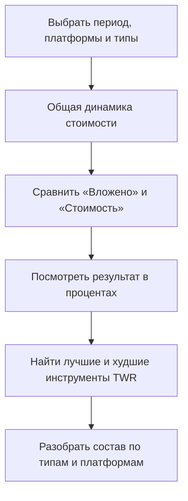
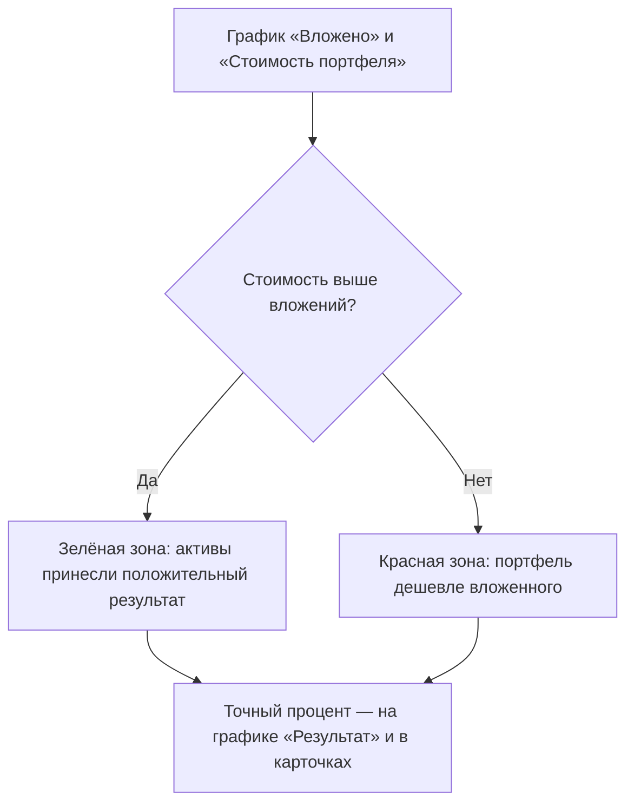

## Введение

Вкладка «История» на странице портфеля показывает, как менялась стоимость ваших активов во времени. Здесь видно, сколько денег вы фактически вложили, сколько портфель стоит на каждую дату, какой результат принесли активы и как менялся состав портфеля.

Вкладка полезна, когда нужно:

- понять, вырос портфель или подешевел за выбранный период;
- отличить рост за счёт новых пополнений от роста за счёт доходности активов;
- увидеть, какие инструменты оказались самыми прибыльными и самыми убыточными;
- проследить, как менялось распределение денег между типами активов и платформами.

Данные загружаются при первом открытии вкладки. Чтобы попасть на неё, откройте страницу портфеля и нажмите «История» в ряду вкладок (Позиции, Вторичный рынок, Аналитика, Календарь, Выплаты, Транзакции, История). Если перейти по ссылке, которая ведёт сразу на эту вкладку, история загрузится сразу.

---

### Валюта отображения

Рядом с названием портфеля есть выбор валюты: BYN, EUR или USD.

- Все суммы на вкладке «История» показываются в выбранной валюте.
- После смены валюты история пересчитывается и загружается заново.
- Выбор запоминается отдельно для каждого портфеля и применяется также на других вкладках этого портфеля.

---

### Панель фильтров и настроек

Панель появляется над графиками и управляет всеми блоками вкладки сразу.

#### Период

Два поля с датами: начало и конец отрезка.

- По умолчанию показываются последние 4 месяца.
- Дата начала не может быть позже даты конца, а дата конца — позже сегодняшнего дня.
- Максимальная длина периода — 3 года. Если выбрать более длинный отрезок, появится сообщение об ошибке.
- После смены любой даты история загружается заново под новый период.

#### Группировка

Кнопки «По дням», «По неделям», «По месяцам», «По годам».

- Определяют, насколько мелкими шагами показаны точки на графиках.
- «По дням» — стандартный режим: одна точка на каждый день.
- При группировке по неделям, месяцам или годам несколько дней объединяются в один шаг. В подсказке при наведении будет виден весь период, например «Неделя 3 марта – 9 марта 2025» или «Март 2025».
- Смена группировки не перезагружает данные — графики просто перерисовываются.

#### Платформа

Ряд кнопок с названиями платформ, на которых есть ваши активы (например, БВФБ, Finstore, Fainex, Bynex, Whitebird).

- Кнопка работает как переключатель: одно нажатие включает платформу, повторное — выключает.
- Можно выбрать несколько платформ сразу.
- Пока не выбрано ни одной — учитываются все платформы.
- Список появляется только тогда, когда в портфеле есть подходящие активы.

#### Тип инструмента

Ряд кнопок с типами активов: Акция, Облигация, Токен, Депозит, Драгоценный металл и другие.

- Работает так же, как фильтр платформ: кнопки-переключатели, можно выбрать несколько.
- Без выбора показываются все типы инструментов.

#### Кнопка «Сбросить»

Красная кнопка с изображением корзины.

- Появляется только когда настройки отличаются от стандартных: выбраны платформы или типы, изменена группировка или даты периода.
- Одним нажатием возвращает всё как было: период на последние 4 месяца, группировка «По дням», фильтры сняты — и заново загружает историю.

---

### Динамика общей стоимости портфеля

Первый и главный блок вкладки.

- Показывает линию, по которой видно, как менялась суммарная стоимость всех активов портфеля от даты к дате.
- Над графиком — четыре карточки:
  - **Начальная стоимость** — сколько портфель стоил в первый день выбранного периода.
  - **Конечная стоимость** — стоимость на последний день периода.
  - **Изменение** — разница между концом и началом. Зелёная с плюсом, если портфель подорожал; красная с минусом, если подешевел.
  - **Изменение %** — та же разница в процентах от начальной стоимости.
- При наведении на точку появляется подсказка с датой и точной суммой.
- Если в какие-то даты данных не хватает, об этом сообщит отдельное предупреждение (см. раздел «Состояния страницы»).

Этот блок даёт общую картину, а следующие — помогают понять, за счёт чего получилось именно такое изменение.

---

### Вложенные средства и стоимость портфеля

Самый содержательный блок вкладки. Он отвечает на вопрос: «Портфель вырос потому, что я добавлял деньги, или потому, что активы реально приносили доход?»

#### Две линии на графике

- **Вложено** — сколько собственных средств вы фактически направили в портфель. Покупки и комиссии увеличивают эту сумму, продажи и снятия — уменьшают.
- **Стоимость портфеля** — расчётная рыночная цена всех активов на ту же дату.

Пространство между линиями подкрашено:

- зелёным — когда портфель стоит дороже, чем в него вложено;
- красным — когда портфель дешевле вложенной суммы.

Если обе линии растут почти одинаково, рост портфеля связан в основном с новыми пополнениями, а не с доходностью активов.

#### Карточки над графиком

- **Вложено** — вложенная сумма на конец периода.
- **Стоимость портфеля** — стоимость на ту же дату.
- **Разница** — результат в деньгах: на сколько стоимость выше или ниже вложений.
- **Результат** — тот же результат в процентах от вложенного. Пока в портфель ничего не вложено, вместо процента показывается прочерк.

#### Результат относительно вложенной суммы

Небольшой график под основным. Показывает ту же разницу, но в процентах и отдельной линией.

- Линия зелёная выше нуля и красная ниже; уровень нуля отмечен серой линией.
- По этому графику удобно искать моменты, когда результат менял знак: портфель переходил из «прибыльных» в «убыточные» и обратно.
- В подсказке при наведении видны все четыре значения: результат в процентах, разница в деньгах, вложено и стоимость.

#### Доходность инструментов (TWR)

Список-диаграмма в нижней части блока.

- Показывает доходность каждого актива за выбранный период. Используется показатель TWR — он убирает влияние пополнений и снятий, поэтому честно отражает, как сработал сам инструмент.
- Рядом с заголовком есть выбор «Показать TOP-N»: TOP-3 (по умолчанию), TOP-5 или TOP-10. Это количество самых успешных и столько же самых убыточных инструментов.
- Инструменты показаны горизонтальными полосами: самые прибыльные сверху, самые убыточные снизу, между ними — красная разделительная линия.
- Цвет полосы означает тип инструмента (акции, облигации, токены и так далее). Нажатие на название типа в легенде скрывает или показывает соответствующие инструменты.
- Подсказка при наведении раскрывает подробности: тип, компанию, платформу, доходность, стоимость на начало и конец периода, чистый поток денег и результат в деньгах.
- Если какой-то инструмент показал очень большую доходность, его полоса визуально укорачивается, чтобы график оставался читаемым. Об этом сообщает подпись под заголовком и стрелки ↗ или ↙ у значения; настоящее значение всегда видно в подписи и подсказке.
- Если за период ни у одного инструмента нет рассчитанной доходности, появляется сообщение «Нет данных для отображения доходности инструментов за выбранный период».

---

### Стоимость по типам и платформам

Два графика рядом: «Стоимость портфеля по типам инструментов» и «Стоимость портфеля по платформам».

- Каждый график — стопка областей: видно, какую долю общей стоимости давал каждый тип актива или каждая платформа на каждую дату.
- Нажатие на название группы в легенде скрывает её или возвращает обратно.
- В подсказке при наведении перечислены все группы с суммами и общий итог.
- Если данных нет, под заголовком появится сообщение «Нет данных по типам инструментов…» или «Нет данных по платформам…».

### Вложенные средства по типам и платформам

Похожая пара графиков, но не про текущую стоимость, а про вложенные деньги.

- Показывает, между какими типами активов и на каких платформах распределялась фактически вложенная сумма.
- Полезно сравнивать с парой выше: например, увидеть, что в токены вложено много, а стоят они теперь меньше, чем вложено.

### Структура стоимости и структура вложений

Два отдельных графика с долями в процентах (от 0 до 100%).

- «Структура стоимости портфеля по типам инструментов» показывает, какую долю портфеля занимал каждый тип актива на каждую дату.
- «Структура вложений в портфель по типам инструментов» делает то же для вложенных средств.
- В подсказке рядом с процентом показана и сумма в деньгах, поэтому легко понять и долю, и абсолютное значение.

---

### Подсказка про оценку акций

Внизу вкладки находится заметка «Почему стоимость акций может немного отличаться?».

- В аналитике акции оцениваются по текущей расчётной цене — обычно по средневзвешенной цене за последние 30 дней.
- В истории для каждой даты используется последняя известная рыночная цена на тот день.
- Поэтому аналитика отвечает на вопрос «сколько портфель стоит сейчас», а история — «как стоимость менялась во времени». Небольшие расхождения между ними — нормальны.

---

### Состояния страницы

- **Загрузка.** Пока история запрашивается, показывается сообщение «Загрузка истории...». Это происходит при первом открытии вкладки и после смены периода, фильтров или валюты.
- **Ошибка.** Если запросить нельзя (например, период длиннее 3 лет), появится красная рамка с текстом ошибки. Исправьте настройки — и история загрузится заново.
- **Нет данных.** Если за выбранный период истории стоимости нет, показывается карточка «Нет данных» с подписью «За выбранный период история стоимости отсутствует». Попробуйте расширить период или снять фильтры по платформе и типу инструмента.
- **Неполные данные.** Если для отдельных дат не хватает исторических курсов валют, появляется предупреждение «Некоторые точки содержат неполные данные». Значения на таких датах могут быть неточными; в подсказках графиков эти точки дополнительно помечены знаком ⚠ и перечислены валюты, курсы которых отсутствуют.

### Общие возможности графиков

- **Подсказка при наведении.** Наведите курсор на любую точку или линию — увидите дату, суммы и дополнительную информацию.
- **Легенда.** Названия под графиком скрывают и возвращают отдельные линии и группы.
- **Меню графика.** Через меню в углу графика (значок с тремя полосками) график можно развернуть на весь экран и сохранить как картинку. Это удобно для длинных периодов и сравнения графиков между собой.

---

### Связи между блоками

Все блоки вкладки читаются как один рассказ: от общего к частному.

Как читать связь между вложениями и стоимостью:

- Первый блок отвечает на вопрос «сколько стало», второй — «за счёт чего», графики TWR — «какие инструменты помогли или помешали», а breakdown-графики — «куда были распределены деньги».
- Фильтры и период вверху одинаково влияют на все блоки ниже, поэтому цифры между блоками всегда согласованы.

---

## Краткий глоссарий

- **Портфель** — набор ваших ценных бумаг, токенов, металлов и депозитов, собранный на одной странице для учёта и анализа.
- **Вложенные средства (Вложено)** — сумма собственных денег, фактически направленных в портфель: покупки и комиссии её увеличивают, продажи и снятия уменьшают.
- **Стоимость портфеля** — расчётная рыночная цена всех активов портфеля на конкретную дату.
- **Результат** — разница между стоимостью портфеля и вложенной суммой; показывается в деньгах и в процентах.
- **TWR (взвешенная по времени доходность)** — показатель доходности актива, который не искажается пополнениями и выводами денег.
- **Группировка** — шаг времени на графиках: день, неделя, месяц или год.
- **Платформа** — торговая площадка или сервис, где учитываются ваши активы (например, БВФБ или Finstore).
