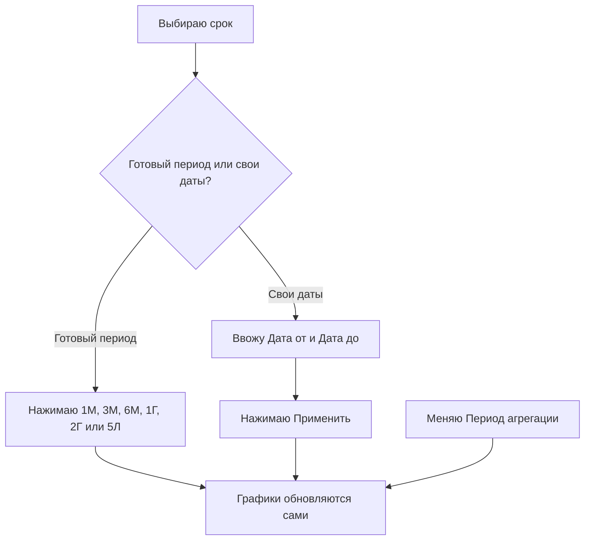
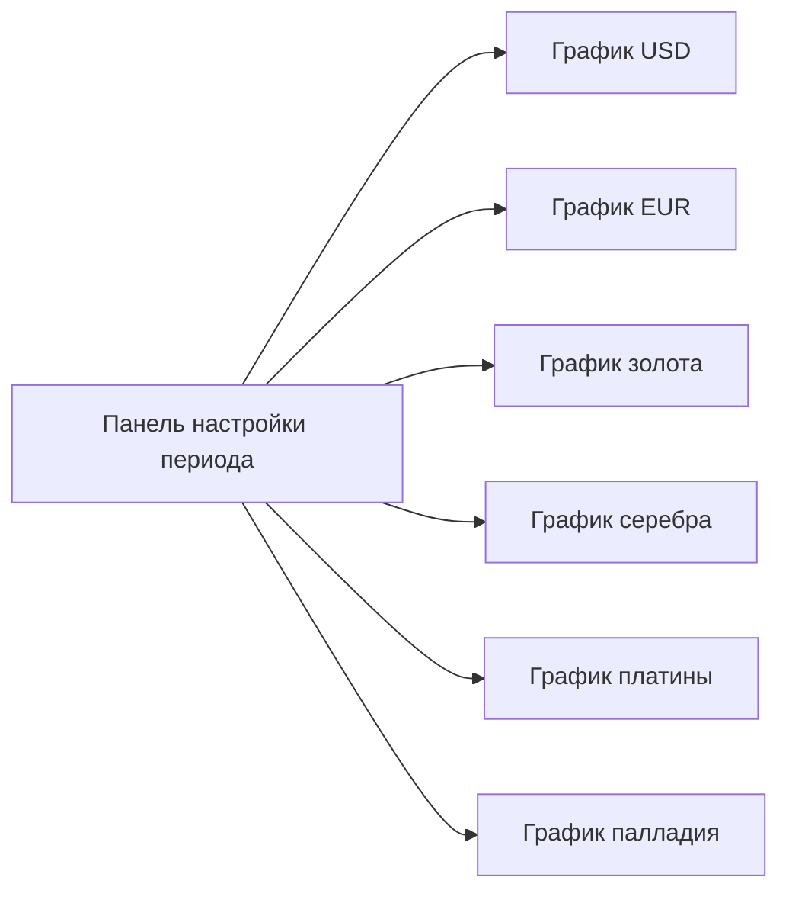

## Введение

На странице собрана [динамика курсов валют и драгоценных металлов в белорусских рублях](https://dashboard.tokenbel.info/statistics/rates/) по данным Национального банка Республики Беларусь.

Страница полезна тем, кто хочет понять, как менялся курс доллара, евро, золота, серебра, платины или палладия за выбранный период. Можно выбрать нужный отрезок времени, степень детализации и посмотреть динамику на наглядных графиках.

---

### Заголовок и описание страницы

Вверху страницы — название и короткое пояснение о том, какие курсы здесь показаны: валюты (USD, EUR) и драгоценные металлы (золото, серебро, платина, палладий) в белорусских рублях.

Сразу под описанием есть ссылка «Подробное описание страницы в справочнике». Она открывает отдельное руководство с дополнительными разъяснениями в новой вкладке.

---

### Панель настройки периода

Эта панель помогает выбрать, за какой срок и с какой детализацией показывать курсы. От выбранных здесь настроек зависят все графики на странице.

#### Кнопки готовых периодов

Слева расположен ряд кнопок с быстрыми периодами:

- **1М** — последние 1 месяц.
- **3М** — последние 3 месяца.
- **6М** — последние 6 месяцев.
- **1Г** — последний 1 год.
- **2Г** — последние 2 года.
- **5Л** — последние 5 лет.

При нажатии на кнопку страница сама подставляет даты начала и конца периода и сразу перерисовывает графики. Выбранная кнопка выделяется. Все периоды отсчитываются назад от вчерашнего дня.

#### Период агрегации

Выпадающий список «Период агрегации» задаёт, как сгруппированы точки на графике:

- **День** — отдельная точка за каждый день.
- **Неделя** — данные объединены по неделям.
- **Месяц** — данные объединены по месяцам.

При выборе нового значения графики обновляются автоматически.

#### Ручной выбор дат

Если готовые кнопки не подходят, период можно задать вручную:

- **Дата от** — начало периода.
- **Дата до** — конец периода. Нельзя выбрать дату позже сегодняшнего дня.
- **Применить** — кнопка, которая перерисовывает графики по выбранным датам.

Начальная дата не может быть позже конечной. По умолчанию конечная дата — это вчерашний день, а начальная соответствует выбранному готовому периоду.

---

### Графики курсов

После настройки периода на странице появляются шесть графиков.

#### Курсы валют

Два графика валют расположены друг под другом во всю ширину:

- **Доллар США (USD)** — курс доллара к белорусскому рублю.
- **Евро (EUR)** — курс евро к белорусскому рублю.

#### Курсы драгоценных металлов

Четыре графика металлов расположены сеткой по два в ряд:

- **Золото (XAU)** — цена золота в BYN за грамм.
- **Серебро (XAG)** — цена серебра в BYN за грамм.
- **Платина (XPT)** — цена платины в BYN за грамм.
- **Палладий (XPD)** — цена палладия в BYN за грамм.

#### Как читать график

Каждый график — это линия, которая показывает изменение курса во времени.

- **Горизонтальная ось** — дата.
- **Вертикальная ось** — значение курса в белорусских рублях. Для валют указано «BYN за 1 USD» или «BYN за 1 EUR», для металлов — «BYN за грамм».
- **Точки на линии** — значения курса на конкретную дату.
- **Подсказка при наведении** — показывает точную дату и значение курса с четырьмя знаками после запятой.

Все шесть графиков всегда показывают один и тот же период и одинаковую степень детализации, заданные в панели настройки.

#### Меню графика

В верхнем углу каждого графика есть кнопка меню. В ней доступны:

- **Полноэкранный режим** — раскрывает график на весь экран, чтобы рассмотреть детали. На телефоне график открывается на весь экран с кнопкой закрытия в виде крестика. На компьютере используется полноэкранный режим браузера.
- **Скачать PNG** — сохраняет график как картинку в формате PNG.
- **Скачать JPEG** — сохраняет график как картинку в формате JPEG.
- **Скачать SVG** — сохраняет график как векторное изображение, которое не теряет качество при увеличении.

---

### Состояния загрузки и ошибок

#### Загрузка курсов

Пока данные подгружаются, вместо графиков показывается сообщение «Загрузка курсов…». Обычно это длится несколько секунд.

#### Ошибка загрузки данных

Если данные загрузить не удалось, появляется красное сообщение «Ошибка загрузки данных» с пояснением, какой именно курс не удалось получить. В таком случае стоит проверить подключение к интернету и попробовать изменить период или обновить страницу.

Если не удалось загрузить библиотеку для построения графиков, сообщение подскажет проверить подключение скриптов.

---

### Связи между блоками

Панель настройки задаёт общие параметры сразу для всех шести графиков. Любое изменение периода, дат или степени детализации моментально отражается на каждом из них одинаково.

---

## Краткий глоссарий

- **Курс валют** — стоимость одной валюты, выраженная в белорусских рублях.
- **Драгоценный металл** — золото, серебро, платина или палладий, цена которых на странице показана в BYN за грамм.
- **BYN** — белорусский рубль, валюта, в которой показаны все курсы на странице.
- **Период агрегации** — способ объединения данных по дням, неделям или месяцам на графике.
- **Национальный банк** — источник данных о курсах валют и драгоценных металлов на странице.
