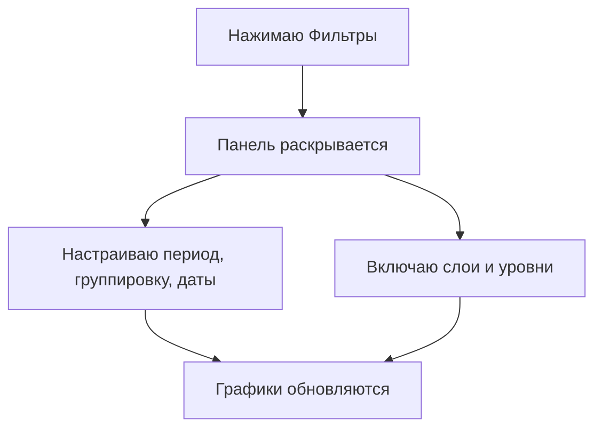
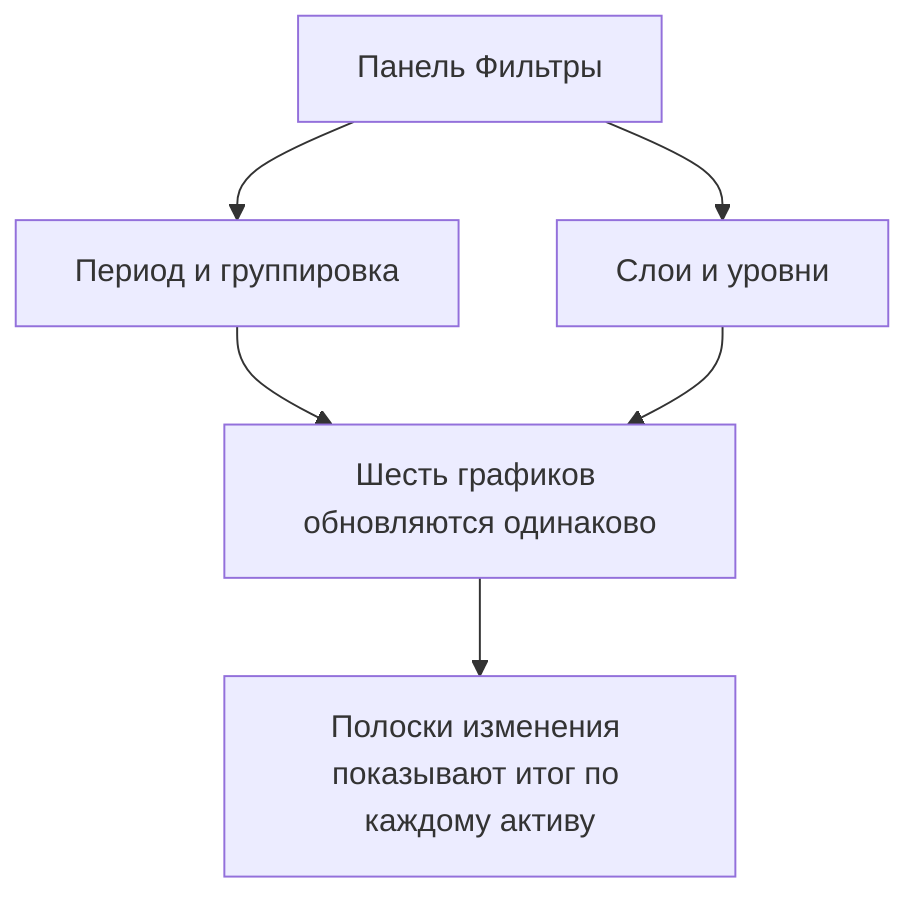

## Введение

На странице собрана [динамика курсов валют и драгоценных металлов в белорусских рублях](https://dashboard.tokenbel.info/statistics/rates/) по данным Национального банка Республики Беларусь.

Страница полезна тем, кто хочет понять, как менялся курс доллара, евро, золота, серебра, платины или палладия за выбранный период. Можно выбрать нужный отрезок времени и степень детализации, включить сглаженные линии тренда и опорные уровни, а также сразу увидеть, на сколько процентов изменился каждый курс с начала периода.

---

### Заголовок и описание страницы

Вверху страницы — название и короткое пояснение о том, какие курсы здесь показаны: валюты (USD, EUR) и драгоценные металлы (золото, серебро, платина, палладий) в белорусских рублях.

Сразу под описанием есть ссылка «Подробное описание страницы в справочнике». Она открывает отдельное руководство с дополнительными разъяснениями в новой вкладке.

---

### Панель фильтров

Все настройки собраны в одной сворачиваемой панели «Фильтры». По умолчанию она закрыта, чтобы не мешать просмотру графиков.

#### Кнопка «Фильтры»

Вверху панели — кнопка «Фильтры» со значком воронки и стрелкой.

- **Открыть панель** — нажмите на кнопку. Стрелка развернётся вниз, и внутри появятся все настройки.
- **Закрыть панель** — нажмите на кнопку ещё раз. Настройки сохранятся, панель свернётся.

Внутри панели находятся: выбор периода, период группировки, диапазон дат, слои и уровни. Любое изменение здесь сразу влияет на все шесть графиков одинаково.

#### Период

Слева расположен ряд кнопок с быстрыми периодами:

- **1М** — последние 1 месяц.
- **3М** — последние 3 месяца.
- **6М** — последние 6 месяцев.
- **1Г** — последний 1 год.
- **2Г** — последние 2 года.
- **5Л** — последние 5 лет.

При нажатии на кнопку страница сама подставляет даты начала и конца периода и сразу перерисовывает графики. Выбранная кнопка выделяется. Все периоды отсчитываются назад от вчерашнего дня. По умолчанию выбран период **1М**.

#### Период группировки

Выпадающий список «Период группировки» задаёт, как сгруппированы точки на графике:

- **День** — отдельная точка за каждый день.
- **Неделя** — данные объединены по неделям.
- **Месяц** — данные объединены по месяцам.

При выборе нового значения графики обновляются автоматически.

#### Диапазон дат

Если готовые кнопки не подходят, период можно задать вручную:

- **от** — начало периода.
- **до** — конец периода. Нельзя выбрать дату позже сегодняшнего дня.
- **Применить** — кнопка, которая перерисовывает графики по выбранным датам.

Начальная дата не может быть позже конечной. По умолчанию конечная дата — это вчерашний день, а начальная соответствует выбранному готовому периоду.

#### Слои

Блок «Слои» включает на графиках дополнительные линии поверх основного курса.

- **Скользящие средние** — сглаженные линии, которые показывают среднее значение курса за выбранный период. Они помогают увидеть общий тренд, не отвлекаясь на ежедневные колебания.
  - Включаются одним тумблером, по умолчанию выключены.
  - После включения появляются три периода — **7**, **30** и **90**, — каждый можно включить или отключить отдельно.
  - Период считается в единицах текущей группировки. При группировке «День» это 7, 30 и 90 дней, при «Неделе» — недель, при «Месяце» — месяцев. Единицы (дн / нед / мес) подписаны рядом с каждым периодом.
  - Под тумблером есть пояснение: «Простое скользящее среднее (SMA) — среднее значение за N последних периодов группировки».

Включение и выключение слоёв обновляет графики сразу, нажимать «Применить» не нужно.

#### Уровни

Блок «Уровни» добавляет на графики горизонтальные линии-ориентиры, которые помогают понять, где курс останавливался или разворачивался.

- **Максимальный** — линия на самом высоком значении курса за период.
- **Минимальный** — линия на самом низком значении.
- **Средний** — линия на среднем значении курса за период.
- **Психологический** — линии на «круглых» значениях, около которых курс часто задерживается (например, 3,0000 или 3,5000).

Все уровни по умолчанию выключены и включаются отдельно. Включение и выключение обновляет графики сразу. У каждой линии есть подпись с точным значением, расположенная чуть выше самой линии.

---

### Полоски изменения курса

Над графиками валют и над сеткой металлов появляются полоски «Изменение с начала периода». Они показывают, на сколько процентов изменился каждый курс от первого до последнего дня выбранного периода.

В каждой строке:

- Цветной кружок и название актива — в тот же цвет, что и линия на графике.
- Процент изменения: зелёным — если курс вырос, красным — если упал, серым — если почти не изменился.

Эти полоски видны всегда и помогают быстро сравнить динамику всех валют между собой и всех металлов между собой.

---

### Графики курсов

После настройки периода на странице появляются шесть графиков.

#### Курсы валют

Два графика валют расположены друг под другом во всю ширину:

- **Доллар США (USD)** — курс доллара к белорусскому рублю.
- **Евро (EUR)** — курс евро к белорусскому рублю.

#### Курсы драгоценных металлов

Четыре графика металлов расположены сеткой по два в ряд:

- **Золото (XAU)** — цена золота в BYN за грамм.
- **Серебро (XAG)** — цена серебра в BYN за грамм.
- **Платина (XPT)** — цена платины в BYN за грамм.
- **Палладий (XPD)** — цена палладия в BYN за грамм.

#### Цвета активов

Каждый актив имеет свой постоянный цвет — на линии графика, в легенде и в полосках изменения. Это помогает легко узнавать активы: доллар — синий, евро — зелёный, золото — золотистый, серебро — серый, платина — фиолетовый, палладий — красный.

#### Как читать график

- **Горизонтальная ось** — дата.
- **Вертикальная ось** — значение курса в белорусских рублях. Для валют указано «BYN за 1 USD» или «BYN за 1 EUR», для металлов — «BYN за грамм».
- **Основная линия** — сам курс. Цвет соответствует активу.
- **Подсказка при наведении** — показывает точную дату и значение курса с четырьмя знаками после запятой, а в скобках — процент изменения от начала периода. Цвет процента подсказывает направление. Если включены скользящие средние, их значения на эту дату тоже видны в подсказке.
- **Легенда** (список линий над графиком) появляется только тогда, когда включены скользящие средние.

#### Дополнительные линии

Когда включены слои и уровни, на графике появляются:

- Сглаженные линии скользящих средних — в более светлых тонах того же цвета, что и актив, пунктирные.
- Горизонтальные линии уровней с подписями значений: максимум и минимум — длинный пунктир, средний и психологические уровни — штрих-пунктир.

#### Меню графика

В верхнем углу каждого графика есть кнопка меню. В ней доступны:

- **Полноэкранный режим** — раскрывает график на весь экран, чтобы рассмотреть детали. На телефоне график открывается на весь экран с кнопкой закрытия в виде крестика. На компьютере используется полноэкранный режим браузера.
- **Скачать PNG** — сохраняет график как картинку в формате PNG.
- **Скачать JPEG** — сохраняет график как картинку в формате JPEG.
- **Скачать SVG** — сохраняет график как векторное изображение, которое не теряет качество при увеличении.

---

### Состояния загрузки и ошибок

#### Загрузка курсов

Пока данные подгружаются, вместо графиков показывается сообщение «Загрузка курсов...». Обычно это длится несколько секунд.

#### Ошибка загрузки данных

Если данные загрузить не удалось, появляется красное сообщение «Ошибка загрузки данных» с пояснением, какой именно курс не удалось получить. В таком случае стоит проверить подключение к интернету и попробовать изменить период или обновить страницу.

Если не удалось загрузить средства для построения графиков, сообщение подскажет проверить подключение.

---

### Связи между блоками

Панель фильтров задаёт общие параметры сразу для всех шести графиков. Любое изменение периода, группировки, дат, слоёв или уровней моментально отражается на каждом из них одинаково. Полоски изменения курса подводят итог по каждому активу за тот же период.

---

## Краткий глоссарий

- **Курс валют** — стоимость одной валюты, выраженная в белорусских рублях.
- **Драгоценный металл** — золото, серебро, платина или палладий, цена которых на странице показана в BYN за грамм.
- **BYN** — белорусский рубль, валюта, в которой показаны все курсы на странице.
- **Период группировки** — способ объединения данных по дням, неделям или месяцам на графике.
- **Скользящее среднее (SMA)** — среднее значение курса за выбранный период; помогает увидеть общий тренд за вычетом ежедневных колебаний.
- **Психологический уровень** — «круглое» значение курса, около которого цена часто задерживается.
- **Национальный банк** — источник данных о курсах валют и драгоценных металлов на странице.
