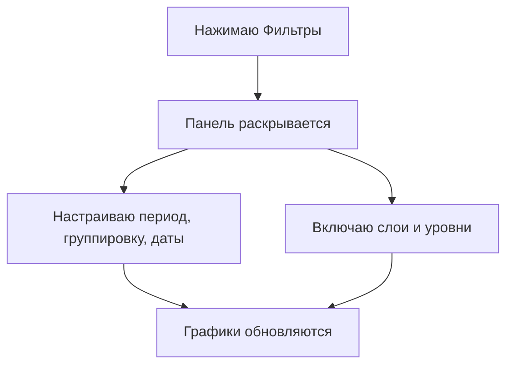
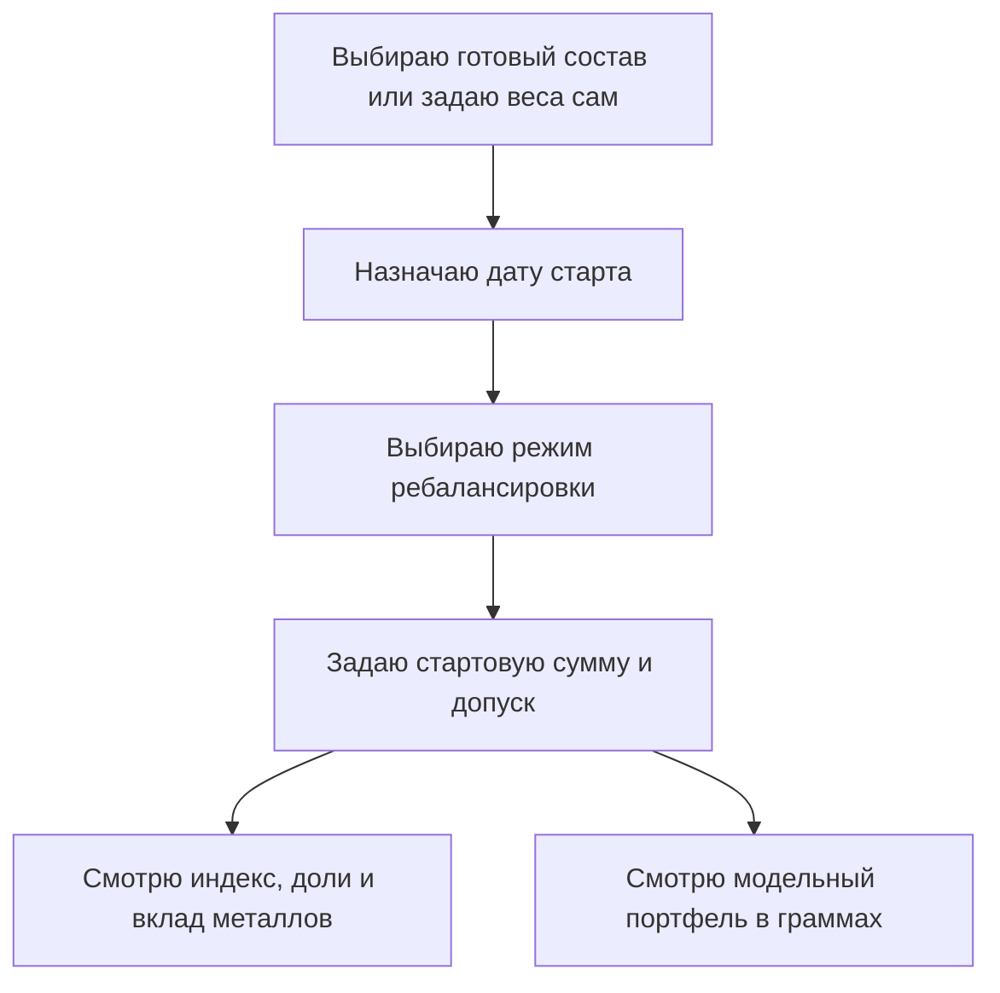
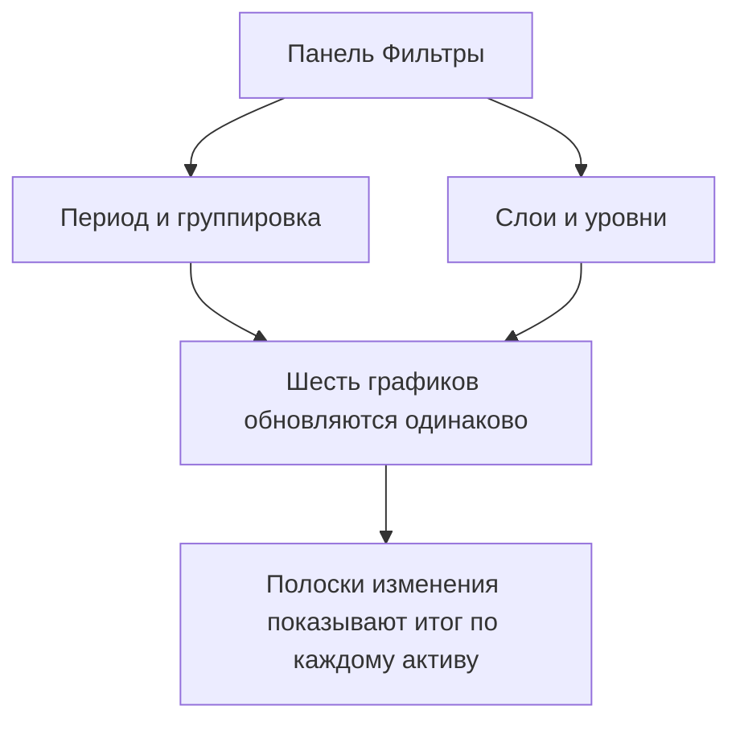
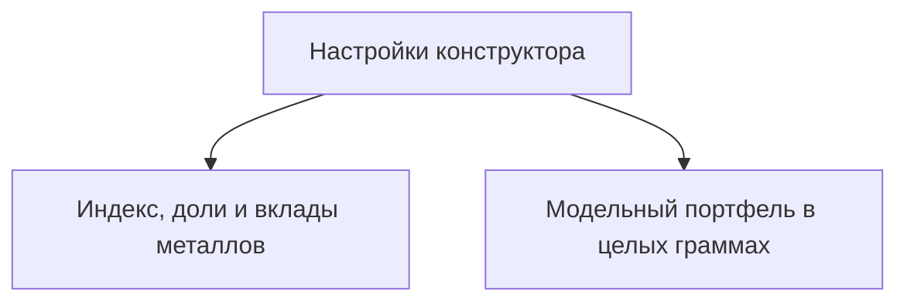

## Введение

На странице собрана [динамика курсов валют и драгоценных металлов в белорусских рублях](https://dashboard.tokenbel.info/statistics/rates/) по данным Национального банка Республики Беларусь.

Страница полезна тем, кто хочет понять, как менялся курс доллара, евро, золота, серебра, платины или палладия за выбранный период. Можно выбрать нужный отрезок времени и степень детализации, включить сглаженные линии тренда и опорные уровни, а также сразу увидеть, на сколько процентов изменился каждый курс с начала периода.

Страница состоит из двух больших частей:

- **Графики курсов** — шесть графиков: доллар, евро, золото, серебро, платина и палладий за выбранный период. Можно менять степень детализации, включать сглаженные линии тренда и опорные уровни, а также сразу видеть, на сколько процентов изменился каждый курс с начала периода.
- **Конструктор индекса драгметаллов** — инструмент, в котором можно собрать собственный индекс из золота, серебра, платины и палладия: задать доли металлов, дату старта и режим ребалансировки, а затем посмотреть, как такой индекс менялся и какой металл сколько внёс в его рост или падение. Дополнительно конструктор строит модельный портфель: показывает, как выглядела бы покупка такой корзины на заданную сумму целыми граммами по учётным ценам Национального банка.

Страница полезна всем, кто хочет понять, как менялись курсы валют и цены на металлы, и сравнить между собой разные составы «металлической корзины».

---

### Заголовок и описание страницы

Вверху страницы — название и короткое пояснение о том, какие курсы здесь показаны: валюты (USD, EUR) и драгоценные металлы (золото, серебро, платина, палладий) в белорусских рублях.

Сразу под описанием есть ссылка «Подробное описание страницы в справочнике». Она открывает отдельное руководство с дополнительными разъяснениями в новой вкладке.

---

### Панель фильтров

Все настройки собраны в одной сворачиваемой панели «Фильтры». По умолчанию она закрыта, чтобы не мешать просмотру графиков.

Панель влияет только на шесть графиков курсов. Конструктор индекса внизу страницы имеет собственные настройки и от этой панели не зависит.

#### Кнопка «Фильтры»

Вверху панели — кнопка «Фильтры» со значком воронки и стрелкой.

- **Открыть панель** — нажмите на кнопку. Стрелка развернётся вниз, и внутри появятся все настройки.
- **Закрыть панель** — нажмите на кнопку ещё раз. Настройки сохранятся, панель свернётся.

Внутри панели находятся: выбор периода, период группировки, диапазон дат, слои и уровни. Любое изменение здесь сразу влияет на все шесть графиков одинаково.

#### Период

Слева расположен ряд кнопок с быстрыми периодами:

- **1М** — последние 1 месяц.
- **3М** — последние 3 месяца.
- **6М** — последние 6 месяцев.
- **1Г** — последний 1 год.
- **2Г** — последние 2 года.
- **5Л** — последние 5 лет.

При нажатии на кнопку страница сама подставляет даты начала и конца периода и сразу перерисовывает графики. Выбранная кнопка выделяется. Все периоды отсчитываются назад от вчерашнего дня. По умолчанию выбран период **1М**.

#### Период группировки

Выпадающий список «Период группировки» задаёт, как сгруппированы точки на графике:

- **День** — отдельная точка за каждый день.
- **Неделя** — данные объединены по неделям.
- **Месяц** — данные объединены по месяцам.

При выборе нового значения графики обновляются автоматически.

#### Диапазон дат

Если готовые кнопки не подходят, период можно задать вручную:

- **от** — начало периода.
- **до** — конец периода. Нельзя выбрать дату позже сегодняшнего дня.
- **Применить** — кнопка, которая перерисовывает графики по выбранным датам.

Начальная дата не может быть позже конечной. По умолчанию конечная дата — это вчерашний день, а начальная соответствует выбранному готовому периоду.

#### Слои

Блок «Слои» включает на графиках дополнительные линии поверх основного курса.

- **Скользящие средние** — сглаженные линии, которые показывают среднее значение курса за выбранный период. Они помогают увидеть общий тренд, не отвлекаясь на ежедневные колебания.
  - Включаются одним тумблером, по умолчанию выключены.
  - После включения появляются три периода — **7**, **30** и **90**, — каждый можно включить или отключить отдельно.
  - Период считается в единицах текущей группировки. При группировке «День» это 7, 30 и 90 дней, при «Неделе» — недель, при «Месяце» — месяцев. Единицы (дн / нед / мес) подписаны рядом с каждым периодом.
  - Под тумблером есть пояснение: «Простое скользящее среднее (SMA) — среднее значение за N последних периодов группировки».

Включение и выключение слоёв обновляет графики сразу, нажимать «Применить» не нужно.

#### Уровни

Блок «Уровни» добавляет на графики горизонтальные линии-ориентиры, которые помогают понять, где курс останавливался или разворачивался.

- **Максимальный** — линия на самом высоком значении курса за период.
- **Минимальный** — линия на самом низком значении.
- **Средний** — линия на среднем значении курса за период.
- **Психологический** — линии на «круглых» значениях, около которых курс часто задерживается (например, 3,0000 или 3,5000).

Все уровни по умолчанию выключены и включаются отдельно. Включение и выключение обновляет графики сразу. У каждой линии есть подпись с точным значением, расположенная чуть выше самой линии.

---

### Полоски изменения курса

Над графиками валют и над сеткой металлов появляются полоски «Изменение с начала периода». Они показывают, на сколько процентов изменился каждый курс от первого до последнего дня выбранного периода.

В каждой строке:

- Цветной кружок и название актива — в тот же цвет, что и линия на графике.
- Процент изменения: зелёным — если курс вырос, красным — если упал, серым — если почти не изменился.

Эти полоски видны всегда и помогают быстро сравнить динамику всех валют между собой и всех металлов между собой.

---

### Графики курсов

После настройки периода на странице появляются шесть графиков.

#### Курсы валют

Два графика валют расположены друг под другом во всю ширину:

- **Доллар США (USD)** — курс доллара к белорусскому рублю.
- **Евро (EUR)** — курс евро к белорусскому рублю.

#### Курсы драгоценных металлов

Четыре графика металлов расположены сеткой по два в ряд:

- **Золото (XAU)** — цена золота в BYN за грамм.
- **Серебро (XAG)** — цена серебра в BYN за грамм.
- **Платина (XPT)** — цена платины в BYN за грамм.
- **Палладий (XPD)** — цена палладия в BYN за грамм.

#### Цвета активов

Каждый актив имеет свой постоянный цвет — на линии графика, в легенде и в полосках изменения. Это помогает легко узнавать активы: доллар — синий, евро — зелёный, золото — золотистый, серебро — серый, платина — фиолетовый, палладий — красный.

#### Как читать график

- **Горизонтальная ось** — дата.
- **Вертикальная ось** — значение курса в белорусских рублях. Для валют указано «BYN за 1 USD» или «BYN за 1 EUR», для металлов — «BYN за грамм».
- **Основная линия** — сам курс. Цвет соответствует активу.
- **Подсказка при наведении** — показывает точную дату и значение курса с четырьмя знаками после запятой, а в скобках — процент изменения от начала периода. Цвет процента подсказывает направление. Если включены скользящие средние, их значения на эту дату тоже видны в подсказке.
- **Легенда** (список линий над графиком) появляется только тогда, когда включены скользящие средние.

#### Дополнительные линии

Когда включены слои и уровни, на графике появляются:

- Сглаженные линии скользящих средних — в более светлых тонах того же цвета, что и актив, пунктирные.
- Горизонтальные линии уровней с подписями значений: максимум и минимум — длинный пунктир, средний и психологические уровни — штрих-пунктир.

#### Меню графика

В верхнем углу каждого графика есть кнопка меню. В ней доступны:

- **Полноэкранный режим** — раскрывает график на весь экран, чтобы рассмотреть детали. На телефоне график открывается на весь экран с кнопкой закрытия в виде крестика. На компьютере используется полноэкранный режим браузера.
- **Скачать PNG** — сохраняет график как картинку в формате PNG.
- **Скачать JPEG** — сохраняет график как картинку в формате JPEG.
- **Скачать SVG** — сохраняет график как векторное изображение, которое не теряет качество при увеличении.

---

### Конструктор индекса драгметаллов

Внизу страницы находится конструктор, в котором можно собрать собственный индекс из драгоценных металлов. Индекс — это условный показатель динамики «корзины» из нескольких металлов с заданными долями. На выбранную дату старта индекс равен **100**, а дальше видно, как менялась бы стоимость такой корзины по учётным ценам Национального банка в BYN за грамм.

По умолчанию в индекс входят все четыре металла с равными долями по 25 %, старт — пять лет назад, ребалансировка — ежеквартальная, стартовая сумма модельного портфеля — 10 000 BYN, допуск долей — 3 п.п., продажи при ребалансировке разрешены.

Что важно понимать:

- Индекс строится только по дням, когда у **всех** выбранных металлов есть опубликованные цены. Дни без цены хотя бы у одного металла в расчёт не попадают.
- Индекс отражает динамику учётных цен НБРБ и не учитывает спред покупки/продажи, комиссии и стоимость хранения физического металла.
- Модельный портфель — справочный расчёт, а не предложение купить металл и не отчёт брокера: он не учитывает дилерские спреды, комиссии, налоги, а также доступность и фактические номиналы физических слитков.
- Настройки конструктора не зависят от панели «Фильтры» вверху: верхние фильтры управляют только графиками курсов.

#### Готовые составы

Ряд кнопок над настройками весов подставляет популярные варианты индекса одним нажатием:

- **Равновзвешенный** — все четыре металла по 25 %.
- **Монетарный (Gold / Silver)** — золото 50 % и серебро 50 %.
- **Золотой** — золото 60 %, серебро 20 %, платина 10 %, палладий 10 %.
- **PGM (Platinum / Palladium)** — платина 50 % и палладий 50 %.

После нажатия состав и веса применяются сразу, результаты пересчитываются. Дальше веса можно менять вручную.

#### Металлы и целевые веса

Основная настройка — список из четырёх металлов: золото, серебро, платина, палладий. У каждого металла есть:

- **Галочка** — включает металл в индекс или исключает его.
- **Название и текущий вес** в процентах.
- **Ползунок** — задаёт целевой вес металла от 0 до 100 %.

Как ведут себя веса:

- Сумма весов всегда равна **100 %** — строка «Итого» под списком это подтверждает.
- Когда вы двигаете ползунок одного металла, остальные выбранные металлы автоматически перераспределяются так, чтобы сохранить свои пропорции между собой. Например, если золото и серебро были по 50 %, и вы увеличили золото до 60 %, серебро станет 40 %.
- Если передвинуть ползунок до нуля, металл просто выключится из индекса (галочка снимется), а его вес поделится между остальными.
- Вернуть металл можно галочкой — он получит равную долю, а остальные сохранят свои пропорции.
- Последний оставшийся металл снять нельзя: галочка не активна, чтобы индекс всегда состоял хотя бы из одного металла.

Любое изменение весов сразу пересчитывает индекс, нажимать что-то ещё не нужно.

#### Допуск, п.п.

Поле «Допуск, п.п.» под строкой «Итого» задаёт, насколько фактическая доля металла в модельном портфеле может отклоняться от целевого веса — в процентных пунктах.

- Отклонение возникает из-за целых граммов: купить «ровно 25 %» золота на произвольную сумму невозможно, поэтому реальные доли всегда немного отличаются от заданных.
- Допуск разрешает потратить остаток денег на докупку граммов тех металлов, чья доля при этом не выйдет за границы «цель ± допуск». Чем больше допуск, тем меньше денег останется в денежном резерве.
- По умолчанию допуск равен 3 п.п. Значение вводится целым числом от 0 до 100.
- Если допуск введён с ошибкой, модельный портфель не рассчитывается, а рядом со стартовой суммой появляется красное пояснение.

#### Дата старта

Поле «Дата старта» задаёт день, к которому индекс приводится к базе 100. Графики строятся от этой даты до последней доступной.

- По умолчанию это день пять лет назад.
- Выбор дат ограничен доступными данными выбранных металлов: раньше самой первой общей цены выбрать нельзя.
- Если на выбранную дату опубликованных цен нет (например, это выходной), дата автоматически сдвигается на ближайшую доступную, а сверху появляется предупреждение об этом.

Сдвинутая дата называется **эффективной датой старта**: именно по ней модельный портфель «покупает» целые граммы металлов.

#### Ребалансировка

Режим ребалансировки определяет, как часто доли металлов возвращаются к заданным целевым весам:

- **Без ребалансировки** — доли задаются один раз на дату старта и дальше «плывут» вместе с ценами: подорожавший металл постепенно занимает всё большую часть индекса.
- **Ежемесячная** — доли возвращаются к целевым в начале каждого месяца.
- **Ежеквартально** — раз в квартал (режим по умолчанию).
- **Ежегодная** — раз в год.

Под режимами есть галочка **«Не продавать металл при ребалансировке»**. Обычно ребалансировка одновременно продаёт подорожавший металл и докупает отстающий. С галочкой уже купленные граммы не продаются никогда: конструктор только докупает отстающие металлы, а если денежного резерва не хватает, условно добавляет недостающие средства. Такой режим ближе к стратегии «купил и держишь» с периодическими пополнениями. Галочка влияет только на модельный портфель и имеет смысл при включённой ребалансировке.

Ребалансировка не добавляет доходности сама по себе — она просто не позволяет одному металлу незаметно «захватить» весь индекс.

#### Стартовая сумма, BYN

Поле «Стартовая сумма, BYN» управляет модельным портфелем — частью конструктора, которая показывает, как выглядела бы реальная покупка собранной корзины.

- Сумма задаётся в белорусских рублях с точностью до двух знаков после запятой. По умолчанию — 10 000 BYN.
- На эту сумму конструктор «покупает» целые граммы металлов по учётным ценам НБРБ на эффективную дату старта — пропорционально заданным весам и в пределах допуска. То, что не удалось вложить в целые граммы, остаётся денежным резервом.
- Если сумма введена с ошибкой — пустое поле, ноль, отрицательное значение, больше двух знаков после запятой или слишком большое число, — поле подсвечивается красным, под ним появляется пояснение, а модельный портфель не рассчитывается. Индекс при этом продолжает работать.
- Любое изменение суммы, допуска или галочки продаж сразу пересчитывает портфель, отдельно нажимать ничего не нужно.

#### Как получается результат

Каждое изменение настроек мгновенно пересчитывает все блоки результатов: график индекса, график фактических долей, блок вклада в изменение и таблицы модельного портфеля.

#### Состояния конструктора

- **Загрузка** — пока история цен подгружается, показывается сообщение «Загрузка истории цен металлов...».
- **Ошибка загрузки** — красное сообщение с кнопкой **«Повторить»**. Стоит проверить подключение к интернету и нажать кнопку ещё раз.
- **Кэшированные данные** — оранжевое уведомление «Актуальные данные временно недоступны. Используются последние доступные кэшированные данные». Индекс считается по последним сохранённым ценам.
- **История ещё наполняется** — оранжевое уведомление о том, что пятилетняя история ещё загружается и доступный диапазон будет расширяться автоматически.
- **Предупреждения** — оранжевые подсказки над результатами: о сдвиге даты старта, об единственном металле в индексе или об отсутствии общих дат с ценами у выбранных металлов. Предупреждения не блокируют работу: если индекс посчитать можно, результаты показываются вместе с ними.
- **Модельный портфель не рассчитан** — красный блок с пояснением причины: обычно это ошибка в стартовой сумме или допуске. Те же пояснения появляются красным текстом под полем «Стартовая сумма». Индекс при этом работает как обычно, а в карточке «Модельный портфель» блока вклада показывается прочерк.

#### Начальная покупка

Модельный портфель описывают четыре блока: начальная покупка, ребалансировки, совокупные покупки и итог модельного портфеля.

Первый блок показывает, как стартовая сумма превращается в граммы металлов на эффективную дату старта. В таблице по строке на каждый металл:

- **Вес** — целевая доля металла в индексе.
- **Факт** — какая доля суммы реально ушла в этот металл после покупки целых граммов.
- **План, BYN** — сколько денег планировалось потратить на металл по его весу.
- **Цена, BYN/г** — учётная цена НБРБ на дату покупки.
- **Куплено, г** — сколько целых граммов куплено.
- **Потрачено, BYN** — сколько денег ушло на покупку.

Строка «Итого» подводит итог по граммам и потраченным деньгам. Под таблицей показан **денежный резерв** — остаток суммы, который не поместился в целые граммы в пределах допуска.

#### Ребалансировки

Блок описывает все торговые операции модельного портфеля после стартовой покупки.

- **Сводка сверху** — режим («продажи разрешены» или «без продаж при ребалансировке»), количество ненулевых операций, сколько потрачено на докупку, сколько получено от продаж, сколько средств условно добавлено и какой денежный резерв остался.
- **Ссылка «Показать операции»** — раскрывает список периодов. У каждого периода указаны дата, с которой действуют новые доли, и дата, по ценам которой прошли операции. Ниже — таблица по металлам: цена, сколько граммов было, сколько куплено и продано, сколько потрачено и получено, сколько граммов стало.
- **Условно добавленная сумма** — показывается в периоде, если при запрете продаж денежного резерва не хватило на докупку.
- **Пометка «целые граммы не позволили точно восстановить целевые веса»** — означает, что из-за округления до целых граммов доли после ребалансировки немного отличаются от целевых.
- **Нет операций** — если операций не было, показано пояснение: за выбранный период целые граммы не потребовали торговых операций.

#### Совокупные покупки и итоговые граммы

Сводная таблица за весь период. По строке на каждый металл:

- **Старт** — сколько граммов куплено на старте и сколько денег на это ушло.
- **Докуплено** — сколько граммов докуплено при ребалансировках и на какую сумму.
- **Продано** — сколько граммов продано и сколько за них получено; продажи показаны отдельно.
- **Всего куплено** — суммарные затраты на этот металл за весь период.
- **Владеете** — итоговые граммы металла на конец периода.

Под таблицей — итоги в деньгах: все покупки, поступления от продаж, условно добавленные средства и чистый денежный отток в металлы.

#### Итог модельного портфеля

Финальный блок отвечает на вопрос «что было бы, если вложить сумму и держать». В таблице — итоговые граммы каждого металла, конечная учётная цена и стоимость металлов на конец периода. Рядом четыре карточки:

- **Металлы на конец** — стоимость всех граммов по конечным ценам.
- **Денежный резерв** — неизрасходованный остаток средств.
- **Всего внесено** — стартовая сумма плюс условно добавленные средства.
- **Итоговая стоимость** — металлы плюс резерв, а под ней изменение в рублях и процентах: зелёным при росте, красным при падении.

Это справочный расчёт по учётным ценам: он не учитывает спреды, комиссии и налоги и не заменяет отчёт брокера.

#### График «Пользовательский индекс»

Главный график конструктора показывает динамику собранного индекса:

- **Синяя линия** — сам индекс. Вертикальная ось подписана «Индекс, база 100»: значения выше 100 означают рост корзины с даты старта, ниже 100 — падение.
- **Горизонтальные уровни** — максимум (зелёный), минимум (красный) и средний (серый) за период, с подписями точных значений.
- **Волатильность** — в заголовке графика показан показатель в процентах годовых: чем он выше, тем сильнее колебался индекс.
- **Подсказка при наведении** — показывает дату, значение индекса, а также цену каждого металла в BYN за грамм и его фактическую долю в индексе на эту дату.
- **Отметка «Показать нормализованные металлы»** — накладывает на график линии отдельных металлов, приведённые к той же базе 100. Так видно, какой металл опережал индекс, а какой отставал. При включённой отметке над графиком появляется легенда с цветами линий.

У графика есть то же меню, что и у графиков курсов: полноэкранный режим и сохранение картинки.

#### График «Фактические доли компонентов»

График показывает, какую часть индекса реально занимал каждый металл в каждый момент времени. Доли показаны цветными областями, вместе составляющими 100 %.

- **Без ребалансировки** области меняют высоту вместе с ценами: подорожавший металл постепенно занимает больше места.
- **С ребалансировкой** доли периодически возвращаются к целевым весам — на графике видно, как области «выравниваются» в начале каждого периода.

Подсказка при наведении показывает точные доли каждого металла в процентах на выбранную дату.

#### Блок «Вклад в изменение индекса»

Этот блок отвечает на вопрос «за счёт чего индекс вырос или упал».

- **Карточка «Ваш индекс»** — итоговое значение индекса и его изменение в процентах: зелёным при росте, красным при падении.
- **Карточка «Модельный портфель»** — итоговая стоимость модельного портфеля в BYN и её изменение в рублях. Если портфель не рассчитан, показывается прочерк.
- **Пояснение под карточкой** — на сколько пунктов изменился индекс, какой металл внёс наибольший положительный вклад и какой сильнее всего тянул индекс вниз.
- **Таблица вкладов** — по строке на каждый металл:
  - **Изменение цены** — на сколько процентов подорожал или подешевел сам металл за период.
  - **Вклад, пунктов** — сколько пунктов итогового изменения индекса обеспечил этот металл с учётом его фактического веса и ребалансировок. Положительный вклад выделен зелёным, отрицательный — красным.
  - **Доля изменения** — какой процент итогового изменения пришёлся на этот металл. Если итоговое изменение близко к нулю, доля не показывается (прочерк), потому что делить практически нечего.
  - Строка **«Итого»** — суммарный вклад всех металлов в пунктах.
- **График вкладов** — показывает, как накапливался вклад каждого металла со временем, и линию «Изменение индекса» для сравнения. Так видно, в какие периоды индексу помогал один металл, а в какие — другой.

Модельный портфель может отличаться от индекса из-за целых граммов, денежного резерва и округления при ребалансировках.

Простое правило чтения: металл с большим весом и сильным ростом цены даёт большой положительный вклад; металл, который упал, — отрицательный, даже если его вес небольшой.

---

### Состояния загрузки и ошибок

#### Загрузка курсов

Пока данные подгружаются, вместо графиков показывается сообщение «Загрузка курсов...». Обычно это длится несколько секунд.

#### Ошибка загрузки данных

Если данные загрузить не удалось, появляется красное сообщение «Ошибка загрузки данных» с пояснением, какой именно курс не удалось получить. В таком случае стоит проверить подключение к интернету и попробовать изменить период или обновить страницу.

Если не удалось загрузить средства для построения графиков, сообщение подскажет проверить подключение.

---

### Связи между блоками

Панель фильтров задаёт общие параметры сразу для всех шести графиков. Любое изменение периода, группировки, дат, слоёв или уровней моментально отражается на каждом из них одинаково. Полоски изменения курса подводят итог по каждому активу за тот же период.

Нижняя часть: конструктор индекса живёт по своим правилам. Его собственные настройки — состав и веса металлов, дата старта, ребалансировка, стартовая сумма, допуск и режим продаж — определяют все блоки результатов: график индекса, график фактических долей, блок вклада в изменение и таблицы модельного портфеля. Все блоки всегда согласованы между собой, потому что считаются по одному и тому же составу, датам и ценам.

---

## Краткий глоссарий

- **Курс валют** — стоимость одной валюты, выраженная в белорусских рублях.
- **Драгоценный металл** — золото, серебро, платина или палладий, цена которых на странице показана в BYN за грамм.
- **BYN** — белорусский рубль, валюта, в которой показаны все курсы на странице.
- **Период группировки** — способ объединения данных по дням, неделям или месяцам на графике.
- **Скользящее среднее (SMA)** — среднее значение курса за выбранный период; помогает увидеть общий тренд за вычетом ежедневных колебаний.
- **Психологический уровень** — «круглое» значение курса, около которого цена часто задерживается.
- **Национальный банк** — источник данных о курсах валют и драгоценных металлов на странице.
- **Индекс драгметаллов** — условный показатель динамики корзины металлов с заданными долями; на дату старта он равен 100.
- **Вес металла** — заданная доля металла в индексе; сумма всех весов всегда равна 100 %.
- **Ребалансировка** — периодический возврат долей металлов к заданным весам.
- **Вклад в изменение индекса** — сколько пунктов итогового роста или падения индекса обеспечил конкретный металл.
- **Модельный портфель** — справочный расчёт покупки корзины металлов на заданную сумму целыми граммами по учётным ценам НБРБ.
- **Денежный резерв** — часть стартовой суммы, которая не поместилась в целые граммы и остаётся в деньгах.
- **Допуск, п.п.** — разрешённое отклонение фактической доли металла от целевого веса из-за покупки целых граммов.
