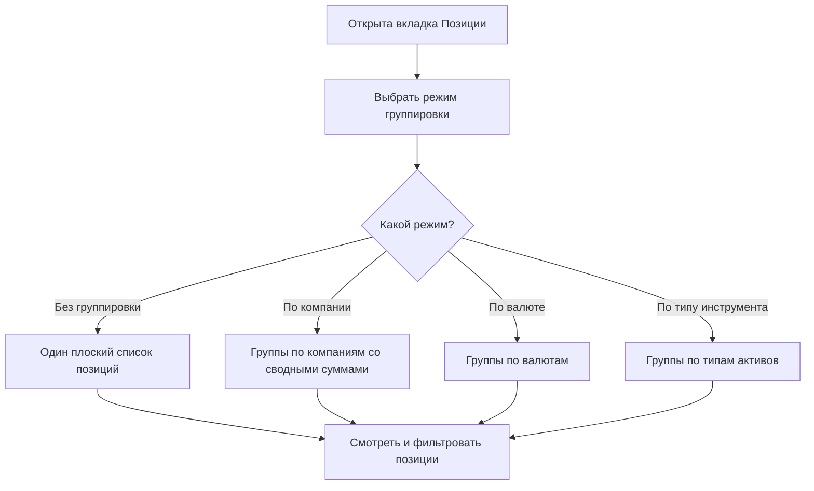
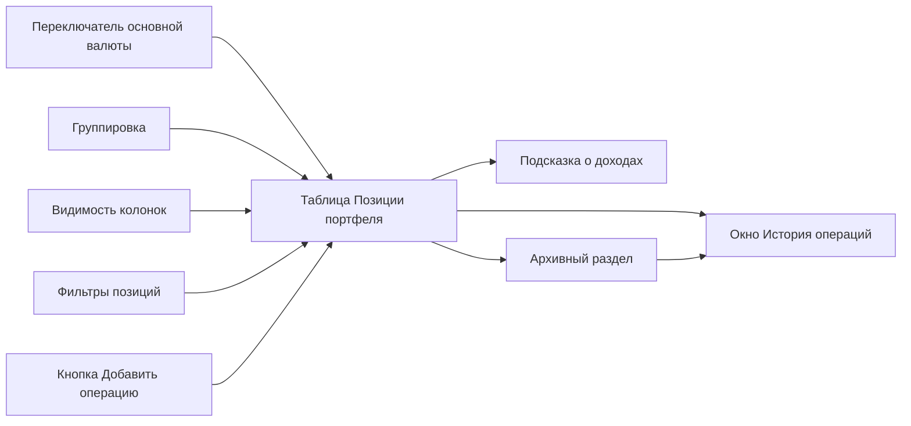

## Введение

Вкладка «Позиции» — это главная часть страницы портфеля. Здесь собраны все ценные бумаги, токены, депозиты и драгоценные металлы, которые вы держите в выбранном портфеле: сколько у вас единиц каждого инструмента, по какой цене, сколько они стоят сейчас и какой доход уже принесли.

Эта вкладка помогает:

- видеть полную картину своих активов;
- понимать текущую стоимость и накопленный доход по каждой позиции;
- добавлять покупки, продажи и другие операции;
- создавать и изменять позиции драгоценных металлов;
- фильтровать и группировать позиции так, как удобно анализировать;
- выгружать данные в Excel для учёта или отчётности.

Сверху над вкладкой находятся название портфеля, переключатель основной валюты и список других вкладок (Вторичный рынок, Аналитика, Календарь, Выплаты, Транзакции, История).

---

### Основная панель действий

Над таблицей позиций расположены заголовок «Позиции портфеля» и кнопки управления таблицей и операциями.

#### Кнопки и их назначение

- **Видимость колонок:** открывает список всех колонок таблицы. Подробнее этот блок описан ниже.
- **Группировка:** меняет способ группировки строк в таблице. Подробнее описан ниже.
- **Добавить операцию:** открывает окно для добавления покупки, продажи, погашения, операции по депозиту или операции с металлом.
- **Скачать Excel (зелёная):** выгружает текущую таблицу активных позиций в файл Excel. Имя файла состоит из названия портфеля и текущей даты.
- **Сбросить колонки:** возвращает вид, ширину и порядок колонок к стандартным настройкам, убирая ваши личные изменения.

#### Переключатель основной валюты

Рядом с названием портфеля находится кнопка с кодом валюты (например, BYN). При нажатии открывается выбор из трёх валют: **BYN, EUR, USD**.

Основная валюта влияет на колонки, в названии которых указана валюта (например, «Сумма, BYN» или «Накопленный доход, USD»). Значения в этих колонках пересчитываются из исходной валюты позиции в выбранную основную валюту по актуальным курсам. Выбор сохраняется отдельно для каждого портфеля.

---

### Видимость колонок

Кнопка «Видимость колонок» открывает выпадающий список, в котором перечислены все доступные колонки основной таблицы позиций.

#### Как пользоваться

- **Галочка возле колонки:** если галочка стоит — колонка видна; если убрана — колонка скрыта.
- **Выбрать все:** включает сразу все колонки.
- **Применение:** изменения применяются сразу при нажатии на галочку, отдельно подтверждать не нужно.

Скрытие колонок не удаляет данные — оно лишь убирает их из виду. Настроенный набор колонок запоминается и сохраняется при следующих визитах. Кнопка «Сбросить колонки» возвращает стандартный набор.

Для металлических позиций в колонке «Количество» показывается количество металла в граммах, а в стоимостных колонках — стоимость этой позиции по цене металла.

---

### Группировка

Кнопка «Группировка» позволяет собирать похожие позиции в раскрывающиеся группы. Название кнопки всегда показывает текущий режим.

#### Доступные режимы

- **Без группировки:** все позиции показаны единым плоским списком, без групп.
- **По компании:** позиции объединяются по компании-эмитенту. Группа показывает суммарную стоимость и доход по всем позициям одной компании. Используется по умолчанию.
- **По валюте:** позиции объединяются по валюте инструмента. Удобно для оценки стоимости активов в каждой валюте отдельно.
- **По типу инструмента:** позиции объединяются по типу (Токен, Облигация, Акция, Депозит, Драгоценный металл). Помогает увидеть структуру портфеля по видам активов.

#### Как работают группы

В режимах с группировкой таблица превращается в «дерево»: строка-группа содержит раскрывающий значок и общую стоимость, а внутри неё перечислены отдельные позиции. В строках-группах показываются сводные суммы по стоимости, общему накопленному доходу и доходу за текущий период — всё в основной валюте. Группы раскрыты по умолчанию, но их можно сворачивать и раскрывать нажатием на значок.

Выбранный режим группировки запоминается и применяется при следующих визитах.

---

### Фильтры позиций

Под кнопками действий находится сворачиваемая панель «Фильтры позиций». По умолчанию она закрыта и открывается нажатием на заголовок. Фильтры сужают список позиций в основной таблице, не затрагивая раздел архивных позиций.

#### Доступные фильтры

- **Компания:** текстовое поле. Помогает найти позиции по части названия компании. Поиск работает по вхождению текста — не обязательно вводить название целиком.
- **Количество:** числовой фильтр из двух частей — условия сравнения и значения. Условия: меньше (`<`), меньше или равно (`<=`), больше (`>`), больше или равно (`>=`, выбрано по умолчанию), равно (`=`), не равно (`!=`). Например, можно показать только позиции, где количество больше 100.
- **Номинал:** числовой фильтр с теми же условиями сравнения, что и у количества. Применяется к номинальной цене позиции.
- **Валюта:** выпадающий список с галочками. Варианты: **BYN, EUR, USD, RUB**. Можно отметить сразу несколько валют. Кнопка «Выбрать все» отмечает или снимает все варианты.
- **Периодичность выплат:** выпадающий список с галочками по типам выплат. Варианты: «В момент покупки», «После окончания обращения», «Ежеквартально», «Ежемесячно», «Раз в 2 месяца», «Раз в полгода», «Ежегодно». Можно выбрать несколько вариантов, есть кнопка «Выбрать все».

Для металлов фильтр по количеству позволяет находить позиции по количеству граммов.

#### Кнопка «Сбросить»

Красная кнопка «Сбросить» убирает все установленные фильтры и возвращает полный список позиций. Условия сравнения для количества и номинала возвращаются к значению «больше или равно».

#### Поведение фильтров

- Фильтры применяются сразу при вводе или выборе значений.
- Если в числовое поле введено некорректное значение, поле подсвечивается красным.
- Фильтры учитывают текущий режим группировки: отфильтрованные позиции остаются внутри своих групп.
- Фильтры не действуют на нижний раздел «Позиции с нулевым количеством и в архиве».

---

### Таблица «Позиции портфеля»

Это основная таблица вкладки. Каждая строка — одна активная позиция (токен, облигация, акция, депозит или драгоценный металл), которой вы владеете в этом портфеле. Для металлов количество учитывается в граммах. В режимах группировки вместо отдельных строк могут отображаться строки-группы со сводными суммами.

Таблицу можно сортировать нажатием на заголовок любой колонки, а колонки можно перетаскивать для изменения порядка. Сортировка, порядок, ширина и видимость колонок запоминаются автоматически.

#### Колонки таблицы

- **Компания:** название компании-эмитента. Нажатие на название открывает страницу компании.
- **Инструмент:** название конкретного инструмента (токена, облигации, акции или драгоценного металла). Нажатие на название открывает страницу инструмента.
- **Тип инструмента:** вид актива — Токен, Облигация, Акция, Депозит или Драгоценный металл.
- **Валюта:** валюта, в которой номинирован инструмент (BYN, EUR, USD, RUB).
- **Количество:** сколько единиц инструмента у вас сейчас в этой позиции. Для металла это количество граммов.
- **Номинальная цена:** номинал одной единицы инструмента в её исходной валюте. Для металла используется цена за один грамм.
- **Ср. цена предложений продажи:** средняя цена, по которой инструмент предлагается на продажу на вторичном рынке за последнее время. Если цена выше номинала — подсвечивается зелёным, если ниже — красным. «0» означает, что рыночных данных пока нет.
- **Ср. цена предложений покупки:** средняя цена, по которой инструмент предлагают купить на вторичном рынке. Подсветка зелёным и красным работает так же, как у цены продажи.
- **Номинальная цена, [основная валюта]:** номинал одной единицы, пересчитанный в основную валюту портфеля.
- **Общий накопленный доход:** доход, накопленный за всё время владения позицией. Для токенов это полный доход с момента покупки, включая все прошлые периоды и текущий незавершённый. Для облигаций — сумма всех полученных купонов с момента покупки, без учёта текущего периода.
- **Общий накопленный доход, [основная валюта]:** то же значение, пересчитанное в основную валюту.
- **Накопленный доход:** доход за текущий период выплат. Для токенов — доход с начала текущего периода (месяц, квартал, полугодие или год — в зависимости от периодичности выплат). Для облигаций — планируемый полный купон за текущий период при условии удержания позиции до его конца.
- **Накопленный доход, [основная валюта]:** доход за текущий период, пересчитанный в основную валюту.
- **Сумма:** стоимость позиции в исходной валюте (количество × текущая цена). Для металла она рассчитывается по количеству граммов и цене за грамм.
- **Сумма, [основная валюта]:** стоимость позиции, пересчитанная в основную валюту.
- **Ставка:** процентная ставка по инструменту (годовая). Показывается со знаком `%`.
- **Дата погашения:** дата, когда инструмент должен быть погашён или возвращён. Показывается в формате ДД.ММ.ГГГГ.
- **Выплаты:** периодичность выплат по инструменту (например, «Ежемесячно», «Ежеквартально», «После окончания обращения»). Для депозитов показывается описание графика выплат.
- **Платформа:** торговая площадка или сервис, на котором выпущен или обращается инструмент (БВФБ, Fainex, Finstore, Bynex, Whitebird). Прочерк означает, что данные недоступны или инструмент добавлен вручную.
- **Налог:** облагается ли доход по инструменту налогом («Да» или «Нет»).
- **Досрочный выкуп:** предусмотрена ли возможность досрочного выкупа («Да» или «Нет»).
- **Действия:** две кнопки — «История операций» (значок часов) и «Удалить» (значок корзины).

В строках-группах (в режимах группировки) большая часть колонок пуста — показываются только сводные суммы по стоимости и доходам в основной валюте.

#### Кнопки в колонке «Действия»

- **История операций (значок часов):** открывает окно со списком всех операций по этой позиции (покупки, продажи, погашения и т. д.).
- **Удалить (значок корзины):** удаляет позицию целиком вместе со всей историей операций. Для драгоценных металлов удаление позиции из таблицы недоступно, чтобы сохранить историю владения металлом.

#### Навигация по страницам таблицы

Под таблицей находится переключатель страниц, если позиций больше, чем помещается на одной странице. Можно выбрать количество строк на странице (10, 25, 50 или 100), по умолчанию показывается 25. Выбранный размер страницы запоминается. Кнопки «Первая», «Предыдущая», «Следующая», «Последняя» помогают перемещаться по страницам.

#### Состояние без данных

Если позиции ещё не загрузились или их нет, таблица остаётся пустой. При ошибке загрузки появляется сообщение «Не удалось загрузить позиции» с кнопкой «Повторить».

---

### Подсказка о колонках с доходом

Сразу под основной таблицей находится блок «Описание столбцов». Он объясняет разницу между «Накопленным доходом» и «Общим накопленным доходом» отдельно для токенов и облигаций:

- **Накопленный доход** для токенов — доход за текущий период выплат; для облигаций — планируемый полный купон за текущий период.
- **Общий накопленный доход** для токенов — полный доход с момента покупки, включая прошлые периоды; для облигаций — сумма всех уже полученных купонов без учёта текущего периода.

Для драгоценных металлов эти показатели не являются основным способом анализа результата: стоимость позиции определяется количеством граммов и ценой за грамм, а покупки и продажи отражаются в истории операций.

---

### Позиции с нулевым количеством и в архиве

Ниже основной таблицы находится отдельный раздел для неактивных позиций. Сюда попадают инструменты, у которых количество равно нулю, либо эмиссия которых уже завершена (истёк срок обращения). Для драгоценных металлов сюда попадают позиции с нулевым количеством.

Этот раздел появляется только тогда, когда в нём есть хотя бы одна позиция. Если архивных позиций нет, раздел скрыт.

#### Кнопки раздела

- **Скачать Excel (зелёная):** выгружает архивную таблицу в файл Excel. Имя файла содержит название портфеля, пометку `zero_amount` и текущую дату.
- **Сбросить колонки:** возвращает стандартный набор, ширину и порядок колонок архивной таблицы.
- **История операций:** открывает историю операций архивной позиции, в том числе закрытого металла.

#### Колонки архивной таблицы

- **Компания:** название компании-эмитента. Нажатие открывает страницу компании.
- **Инструмент:** название инструмента. Нажатие открывает страницу инструмента.
- **Тип инструмента:** вид актива — Токен, Облигация, Акция, Депозит или Драгоценный металл.
- **Валюта:** валюта инструмента.
- **Количество:** сколько единиц осталось (для металла — граммы).
- **Общий накопленный доход, [основная валюта]:** суммарный накопленный доход по позиции, пересчитанный в основную валюту.
- **Платформа:** торговая площадка или сервис инструмента.
- **Действия:** кнопка «История операций». Удаление металлической позиции из архива недоступно.

Архивная таблица также поддерживает сортировку по заголовкам колонок, перетаскивание колонок и запоминание настроек. Внизу есть переключатель страниц и выбор количества строк (по умолчанию 10).

---

### Окно «Добавить операцию»

Открывается кнопкой «Добавить операцию» и позволяет внести новую операцию по покупке, продаже, погашению, пополнению или драгоценному металлу.

#### Выбор типа инструмента

Вверху окна находится переключатель из пяти вкладок: **Токены, Облигации, Акции, Депозиты, Металлы**. Выбор вкладки меняет состав полей формы.

#### Поля для токенов, облигаций и акций

- **Инструмент:** поле поиска и выбора нужного инструмента. Можно искать по названию (для токенов) или по тикеру (для облигаций и акций). Если нужного токена нет, предлагается ссылка «Добавить свой инструмент». Для выбора доступны и ваши собственные эмиссии.
- **Количество:** сколько единиц покупается, продаётся или погашается. Целое число, больше нуля.
- **Цена (за единицу):** цена одной единицы в валюте инструмента. При выборе инструмента поле автоматически заполняется его ценой, но значение можно изменить.
- **Тип операции:** «Покупка», «Продажа» или «Погашение» (погашение недоступно для акций).
- **Тип рынка:** появляется для покупки и продажи. Варианты: «Первичный» или «Вторичный». Влияет на то, как операция учитывается в истории.
- **Дата операции:** дата совершения операции. По умолчанию подставляется сегодняшняя дата. Дата не может быть в будущем.
- **Комментарий:** необязательное примечание к операции (до 250 символов).

#### Поля для депозитов

- **Шаблон или активный депозит:** выбор из списка. Можно начать новый депозит по шаблону или пополнить уже открытый активный депозит. Под списком показывается подсказка, что именно произойдёт.
- **Сумма:** сумма депозита или пополнения (больше нуля).

Если активных шаблонов депозитов нет, показывается сообщение со ссылкой на раздел шаблонов.

#### Драгоценные металлы

Для металлов предусмотрены два режима.

##### Режим «Новая позиция»

Выберите этот режим, если в портфеле ещё нет подходящей позиции. Затем укажите:

1. металл: золото, серебро, платина или палладий;
2. способ владения: **ОМС (банк)** или **Физический**;
3. банк — обязательно для ОМС;
4. количество в граммах;
5. цену за 1 грамм;
6. дату операции и, при необходимости, комментарий.

Новая позиция всегда начинается с покупки. В этом режиме продажа скрыта и недоступна. Если активная позиция с такой же комбинацией металла, способа владения и банка уже существует, добавьте покупку к существующей позиции через режим «Изменить существующую».

Цена за грамм может заполниться последним доступным значением автоматически, но перед сохранением её можно изменить. Количество граммов и цена должны быть больше нуля.

##### Режим «Изменить существующую»

Выберите этот режим, чтобы добавить операцию к уже созданной позиции металла. В списке «Позиция металла» доступны все позиции металлов портфеля — активные и закрытые. В подписи позиции отображаются металл, способ владения, банк для ОМС, количество граммов и статус.

После выбора позиции доступны операции:

- **Покупка** — увеличивает количество граммов;
- **Продажа** — уменьшает количество граммов.

Продать можно только доступное количество граммов. Продажа закрытой позиции недоступна. Покупка по закрытой позиции снова открывает её, если после операции количество стало положительным.

Для существующей позиции металл, способ владения и банк выбираются из самой позиции. В форме остаются количество граммов, цена за грамм, дата и комментарий.

Общие правила для операции с металлом:

- дата не может быть будущей;
- комментарий может содержать до 250 символов;
- количество граммов должно быть больше нуля;
- цена за 1 грамм должна быть больше нуля;
- нельзя продать больше граммов, чем есть на позиции.

#### Что происходит после добавления

- При успешном добавлении окно закрывается, появляется сообщение об успехе, а таблица позиций обновляется.
- Если данных не хватает или они некорректны, появляется сообщение об ошибке с пояснением (например, «Выберите инструмент», «Количество должно быть больше 0», «Дата операции не может быть в будущем»).
- При попытке продать больше, чем есть в наличии, появится предупреждение о нехватке средств с указанием доступного и запрошенного количества.

Окно закрывается кнопкой «Отмена», крестиком в углу или клавишей Escape.

---

### Окно «История операций»

Открывается кнопкой «История операций» (значок часов) в колонке «Действия». Показывает все операции по выбранной позиции, включая покупки и продажи драгоценного металла.

#### Состояния окна

- **Загрузка:** надпись «Загрузка операций...».
- **Ошибка:** сообщение «Не удалось загрузить операции» с кнопкой «Повторить».
- **Пусто:** сообщение «Нет операций для этой позиции», если операций не было.
- **Список операций:** таблица с историей.

#### Колонки истории операций

- **Дата:** дата операции в формате ДД.ММ.ГГГГ.
- **Тип:** вид операции цветной меткой — «Покупка», «Покупка (вторичный)», «Продажа», «Продажа (вторичный)», «Офферта» и другие.
- **Кол-во:** количество единиц в операции.
- **Цена:** цена за единицу.
- **Комментарий:** примечание к операции, если оно было добавлено.
- **Действия:** кнопка «Удалить» для удаления отдельной операции.

Для драгоценных металлов в истории используются количество в граммах и цена за грамм. Историю металла можно просматривать, но отдельные операции металла удалить из этого окна нельзя.

Список отсортирован от новых операций к старым. В правом верхнем углу есть кнопка «Скачать Excel» для выгрузки истории операций в файл. Кнопка «Удалить» рядом с операцией сначала попросит подтверждение.

---

### Связи между блоками

- Выбор основной валюты и режима группировки меняет вид основной таблицы.
- Фильтры и видимость колонок помогают сузить и настроить отображение данных в таблице.
- Кнопка «Добавить операцию» пополняет таблицу новыми данными.
- Покупка металла создаёт новую позицию, а последующие покупки и продажи меняют количество граммов существующей позиции.
- Из таблицы можно перейти к истории операций по конкретной позиции.
- Архивный раздел работает так же, как основная таблица, но показывает только неактивные позиции.

---

## Краткий глоссарий

- **Позиция:** отдельный инструмент или драгоценный металл в портфеле с текущим количеством и историей операций по нему.
- **Инструмент:** ценная бумага, токен, депозит или драгоценный металл, которым вы владеете или с которым совершаете операции.
- **Драгоценный металл:** золото, серебро, платина или палладий, учёт которых ведётся в граммах.
- **ОМС:** обезличенный металлический счёт в банке, где металл учитывается без передачи пользователю слитка.
- **Физический металл:** металл, которым пользователь владеет в физической форме.
- **Токен:** цифровая ценная бумага эмиссии, по которой начисляется процентный доход.
- **Облигация:** ценная бумага с регулярными выплатами (купонами) и датой погашения.
- **Номинальная цена:** стоимость одной единицы инструмента, установленная при выпуске; для металла — цена одного грамма.
- **Накопленный доход:** доход, начисленный за текущий период выплат по позиции.
- **Общий накопленный доход:** доход, накопленный за всё время владения позицией, включая прошлые периоды.
- **Купон:** регулярная выплата дохода по облигации за определённый период.
- **Досрочный выкуп:** возможность для эмитента или владельца погасить инструмент раньше даты погашения.
