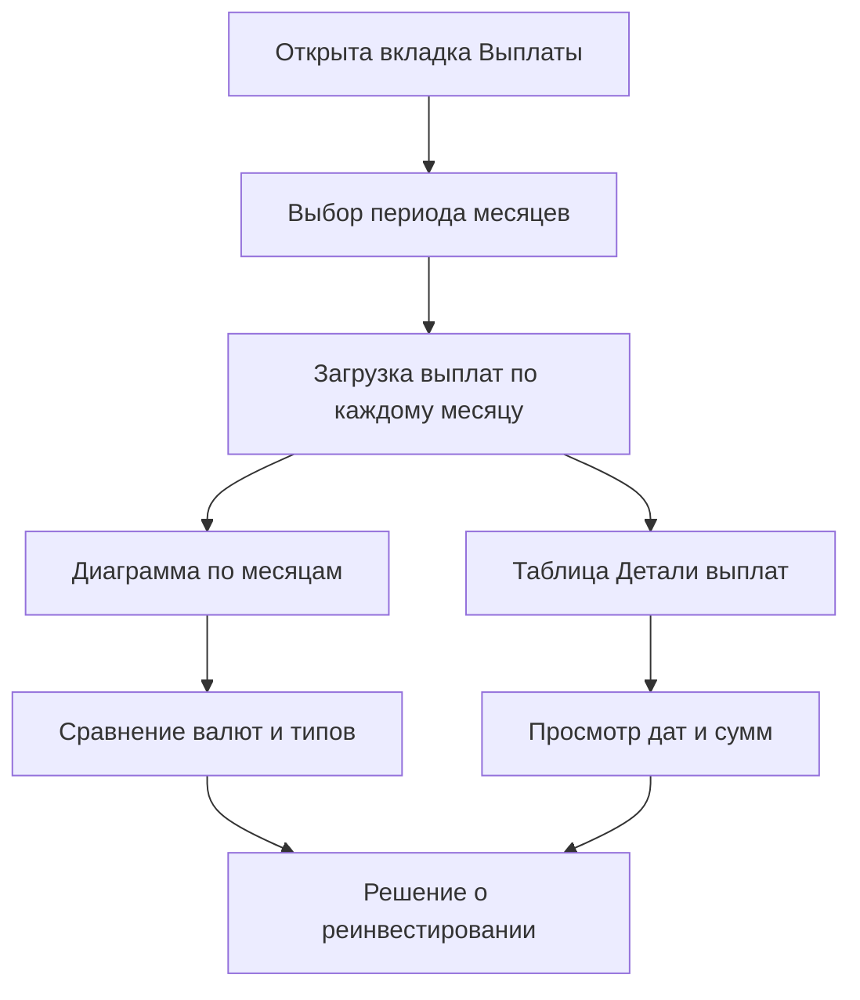
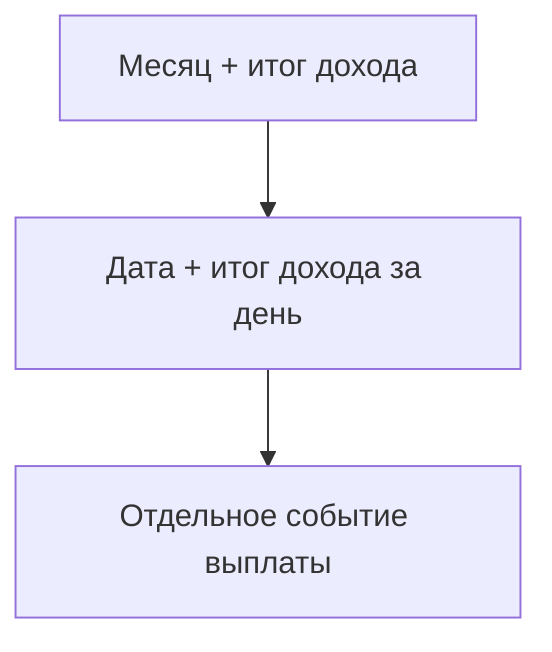
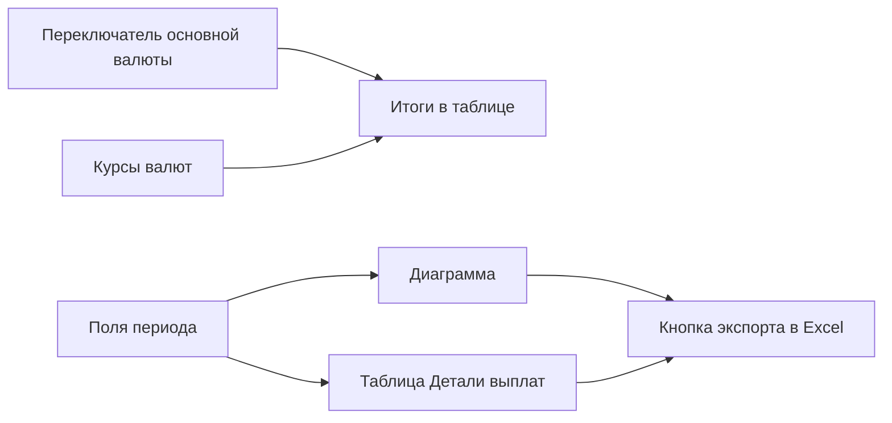

## Введение

Вкладка «Выплаты» показывает расписание будущих поступлений по вашему портфелю: когда и сколько денег вы получите от токенов, облигаций и депозитов. Здесь собраны два вида событий:

- **Выплаты (доход)** — регулярные процентные выплаты и начисления по вашим инструментам.
- **Погашения (возврат тела)** — возврат номинальной стоимости токена при окончании эмиссии или возврат тела депозита.

Эта вкладка помогает:

- заранее увидеть, в какие месяцы и дни ожидаются поступления;
- сравнить доход в разных валютах;
- понять, какая часть денег — это процентный доход, а какая — возврат вложенной суммы;
- спланировать реинвестирование или снятие средств.

По умолчанию показывается ближайший квартал: текущий месяц и два следующих. Диапазон можно изменить вручную.



[](https://cdn-wiki.tokenbel.info/wiki/media/images/74/7481787ca947b95c545a5ab457e92ead48176f9f177e90578ef4d997969f9553.png)

---

### Как считаются события и суммы

Все события на вкладке делятся на две категории. Понимание разницы между ними важно для чтения итогов.

#### Выплаты (процентный доход)

К выплатам относятся:

- ежемесячные выплаты по токенам и облигациям;
- выплаты процентов по депозитам;
- капитализация процентов по депозитам.

Сумма ежемесячной выплаты по токену или облигации рассчитывается заранее и приходит уже посчитанной — это та сумма, которую вы должны получить за указанный месяц.

Для депозитов сумма берётся из графика платежей: это чистая сумма процентов (за вычетом налога) по каждой плановой дате.

#### Погашения (возврат тела)

Погашение — это возврат вложенной основной суммы. Оно показывается отдельно, чтобы вы не путали доход с возвратом своих же денег.

```text
Сумма погашения токена = Количество × Номинальная цена
```

Погашение токена показывается в том месяце, на который приходится дата окончания эмиссии. Для депозита возврат тела показывается в месяц возврата тела депозита.

#### Итоги в основной валюте

Рядом с каждым месяцем и датой в таблице «Детали выплат» показан промежуточный итог. Он пересчитан в основную валюту портфеля (BYN, EUR или USD) по сохранённым курсам:

```text
Сумма в основной валюте = Сумма выплаты × Курс валюты
```

Важно: в этот итог входят **только выплаты (процентный доход)**. Суммы погашений (возврат тела) в итог не прибавляются, потому что это не доход, а возврат ваших собственных средств. Так вы видите чистую картину будущего дохода, не смешанную с возвратом вложений.

---

### Выбор периода

В верхней части вкладки находится панель «Период» с двумя полями: начало и конец диапазона.

#### Поля диапазона

- **Левое поле (начало):** месяц, с которого начинается показ. Нажмите на поле, чтобы открыть список и выбрать месяц.
- **Правое поле (конец):** месяц, на котором заканчивается показ. Выбирается так же.

В каждом списке доступны все месяцы в окне четырёх лет: два года назад, текущий год и два года вперёд. Месяцы подписаны по-русски («Март 2026»).

#### Кнопки

- **Применить:** пересчитывает данные по выбранному диапазону. Кнопка недоступна, пока диапазон некорректен.
- **Сбросить:** возвращает диапазон к значению по умолчанию — текущий месяц и два следующих (ближайший квартал).

#### Правила выбора диапазона

- Начало не может быть позже конца.
- Максимальная длина диапазона — 12 месяцев. Если выбрать больше, кнопка «Применить» останется недоступной.

Данные по каждому выбранному месяцу загружаются один раз и сохраняются, поэтому повторное открытие того же месяца происходит мгновенно.

---

### Группировка диаграммы

Над диаграммой находится переключатель «Группировка» с двумя вариантами. Он меняет то, как столбцы поделены на серии.

- **По типу (по умолчанию):** для каждой валюты создаются две отдельные серии — «Выплата» (процентный доход) и «Погашение» (возврат тела). Так видно, какая часть столбца — это доход, а какая — возврат вложений.
- **По валюте:** для каждой валюты создаётся одна серия, в которой выплаты и погашения сложены вместе. Так удобнее сравнивать общую сумму поступлений по валютам.

Переключение пересоздаёт диаграмму немедленно.

---

### Диаграмма выплат

Основной блок вкладки — столбчатая диаграмма по месяцам. Она показывает ожидаемые поступления за выбранный период.

#### Оси и столбцы

- **Горизонтальная ось:** месяцы выбранного диапазона, подписанные по-русски.
- **Вертикальная ось:** сумма поступлений.
- **Столбцы:** рядом друг с другом (не внахлёст). Каждый столбец — это сумма за конкретный месяц по конкретной серии (валюте или типу).

Каждый столбец подписан числом и названием серии, поэтому значения видны без наведения.

#### Подсказка при наведении

Если навести курсор на любой месяц, появляется общая подсказка со всеми сериями сразу: названием серии и точной суммой с тремя знаками после запятой.

#### Легенда и управление

- Под диаграммой — легенда с цветами серий.
- В правом верхнем углу диаграммы — меню с кнопками: полноэкранный режим, сохранение в PNG, JPEG или SVG.

#### Поведение на телефоне

На узких экранах диаграмма становится ниже, подписи месяцев разворачиваются вертикально, а числовые подписи на столбцах скрываются, чтобы не загромождать вид.

---

### Детали выплат

Под диаграммой находится таблица «Детали выплат» с детальным расписанием каждого события. Она имеет трёхуровневую структуру и открывается развёрнутой.

[](https://cdn-wiki.tokenbel.info/wiki/media/images/09/090fee3447368dfa747ad99b667ebffc533e55931f00c42c91be51d5e356ff2b.png)

#### Три уровня таблицы



1. **Строка месяца:** название месяца и год, рядом — итог процентного дохода за этот месяц в основной валюте. Итог зелёным цветом, если за месяц есть доход.
2. **Строка даты:** конкретное число («31 января»), рядом — итог процентного дохода за этот день в основной валюте.
3. **Строка события:** одна отдельная выплата или погашение со всеми подробностями.

Любую группу можно свернуть, нажав на значок рядом со строкой месяца или даты.

#### Колонки таблицы

- **Компания:** название компании-эмитента. Это ссылка на страницу компании. На уровне события название немного сдвинуто вправо.
- **Эмиссия:** название инструмента (токена или депозита). Для токенов и облигаций это ссылка на страницу инструмента. Для депозитов название показано простым текстом, так как у депозита нет отдельной страницы.
- **Тип:** цветная метка события.
- **Сумма:** сумма события в исходной валюте инструмента с тремя знаками после запятой.

Строки месяца и даты показывают только свои итоги, ячейки «Эмиссия», «Тип» и «Сумма» у них пустые.

#### Метки типа события

Тип события показывается цветной меткой:

- **Выплата** (голубая) — процентная выплата по токену, облигации или депозиту.
- **Капитализация %** (голубая) — причисление процентов к телу депозита.
- **Погашение** (зелёная) — возврат номинальной стоимости токена или тела депозита.

---

### Экспорт в Excel

В правом верхнем углу блока «Детали выплат» находится зелёная кнопка загрузки. Она сохраняет таблицу выплат в файл Excel.

#### Что попадает в файл

В файле сохраняется та же трёхуровневая структура, что и на экране:

- строка месяца с итогом дохода;
- строка даты с итогом за день;
- строка события с компанией, инструментом, типом и суммой.

Уровни вложенности обозначены отступами, поэтому иерархия легко читается. Колонки те же: «Компания», «Эмиссия», «Тип», «Сумма».

Имя файла состоит из названия портфеля, слова `payouts` и текущей даты.

---

### Связи между блоками



- Выбранный период определяет, какие месяцы показаны и на диаграмме, и в таблице.
- Переключатель основной валюты и сохранённые курсы влияют на итоги в строках месяца и даты.
- Диаграмма показывает обзор по месяцам, а таблица раскрывает каждое событие отдельно.
- Кнопка экспорта выгружает именно таблицу «Детали выплат».

Если добавить или изменить позицию на вкладке «Позиции», данные выплат обновятся при следующем выборе периода.

---

### Состояния загрузки и ошибок

- **Загрузка:** пока данные подгружаются, показывается сообщение «Загрузка расписания выплат…».
- **Ошибка сети:** если данные не удалось загрузить, появляется красное предупреждение с описанием ошибки.
- **Нет данных:** если за выбранный период не ожидается ни одной выплаты или погашения, показывается сообщение «Нет данных о выплатах за выбранный период». В этом случае блок «Детали выплат» скрыт.

---

## Краткий глоссарий

- **Выплата:** процентный доход по инструменту — те деньги, которые вы получаете как вознаграждение за вложения.
- **Погашение:** возврат основной суммы вложений (номинала токена или тела депозита) в конце срока.
- **Номинальная цена:** стоимость одной единицы инструмента, по которой эмитент возвращает деньги при погашении.
- **Капитализация процентов:** причисление начисленных процентов к телу депозита, чтобы в дальнейшем проценты начислялись на увеличенную сумму.
- **Основная валюта портфеля:** валюта (BYN, EUR или USD), в которую пересчитываются все итоги для удобства сравнения.
- **Эмиссия:** выпуск токенов определённой компанией; здесь — конкретный инструмент, по которому приходят выплаты.
